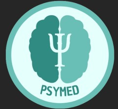
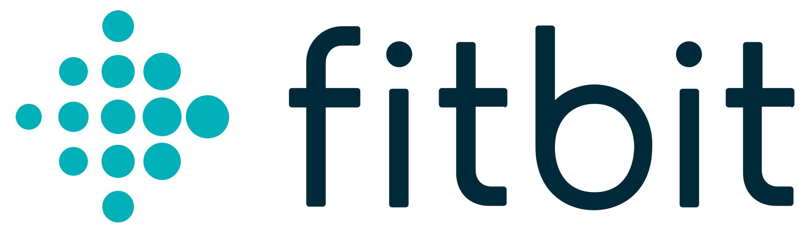
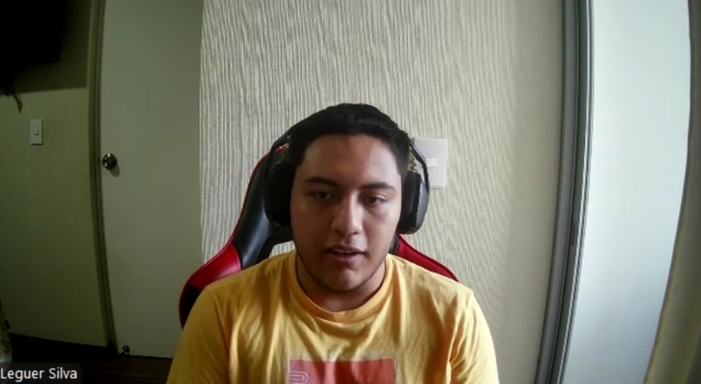
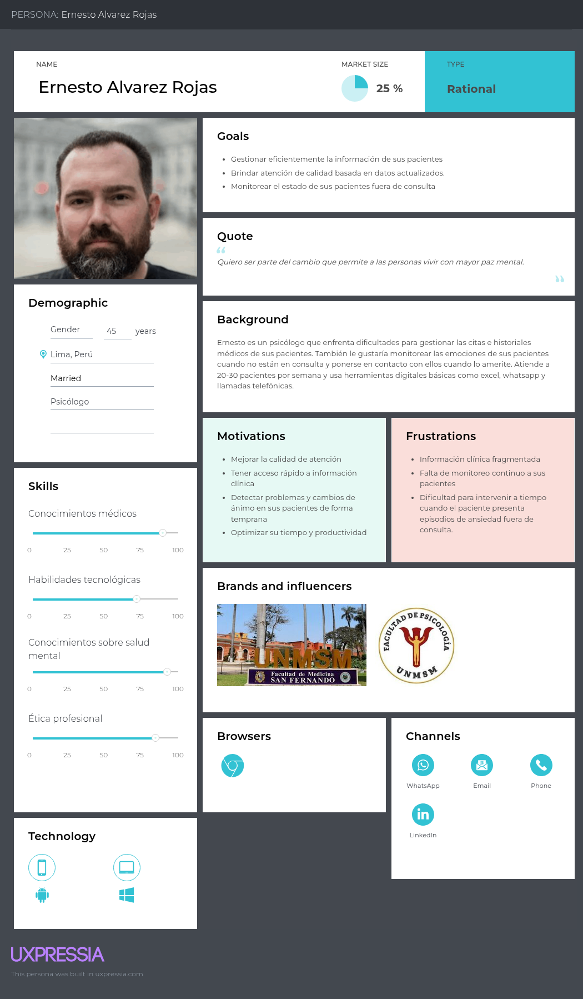
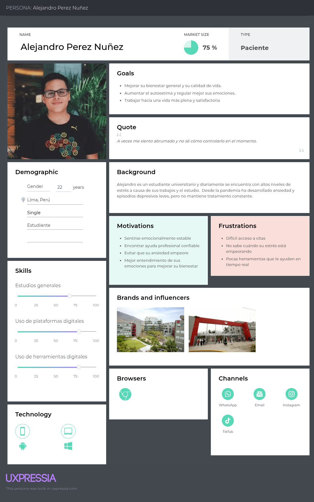

# Capítulo II: Requirements Elicitation & Analysis

## 2.1. Competidores.

### 2.1.1. Análisis competitivo.

<body class="c23 doc-content">
<table class="c19">
<tr class="c14">
<td class="c21" colspan="6" rowspan="1">
Competitive Analysis Landscape
</td>
</tr>
<tr class="c12">
<td class="c20" colspan="2" rowspan="1">
¿Por qué realizar este análisis?
</td>
<td class="c26" colspan="4" rowspan="1">
El análisis competitivo es esencial para entender el mercado, identificar oportunidades de
diferenciación y anticipar amenazas. Permite ajustar la estrategia para ganar ventaja sobre la
competencia y asegurar el éxito del producto.
</td>
</tr>
<tr class="c12">
<td class="c20" colspan="2" rowspan="1">
Nombre
</td>
<td class="c7" colspan="1" rowspan="1">
Psymed
</td>
<td class="c1" colspan="1" rowspan="1">

Apollo Neuro

</td>
<td class="c1" colspan="1" rowspan="1">
Fitbit
</td>
<td class="c9" colspan="1" rowspan="1">
Empatica EmbracePlus
</td>
</tr>
<tr class="c12">
<td class="c20" colspan="2" rowspan="1">
Logo
</td>
<td class="c7" colspan="1" rowspan="1">

</td>
<td class="c1" colspan="1" rowspan="1">

</td>
<td class="c1" colspan="1" rowspan="1">

</td>
<td class="c9" colspan="1" rowspan="1">

</td>
</tr>
<tr class="c18">
<td class="c11" colspan="1" rowspan="2">
Perfil
</td>
<td class="c6" colspan="1" rowspan="1">
Overview
</td>
<td class="c7" colspan="1" rowspan="1">
PsyMed es una plataforma diseñada para centralizar la gestión de información de pacientes en instituciones de salud mental, mejorando la eficiencia operativa y facilitando la colaboración entre profesionales. Además, integra un sistema de monitoreo continuo mediante sensores de frecuencia cardíaca y temperatura, permitiendo obtener datos fisiológicos en tiempo real. En su plan premium, incluye un brazalete inteligente que incorpora estos sensores y un actuador físico de vibración háptica, el cual se activa automáticamente como mecanismo de relajación ante la detección de niveles elevados de estrés o ansiedad, contribuyendo así a una intervención temprana y a la mejora del bienestar del paciente.
</td>
<td class="c1" colspan="1" rowspan="1">
Apollo Neuro es una solución wearable enfocada en la mejora del bienestar emocional mediante la estimulación del sistema nervioso. A través de vibraciones suaves, el dispositivo busca reducir el estrés, mejorar el sueño y aumentar la concentración, actuando directamente sobre el cuerpo en lugar de limitarse al monitoreo de datos. No solo se sentra en la medición de datos biométricos, sino en la intervención activa para mejorar el estado fisiológico del usuario.
</td>
<td class="c1" colspan="1" rowspan="1">
Fitbit es una plataforma de dispositivos wearables orientada al monitoreo general de la salud y el bienestar, que permite recopilar datos como frecuencia cardíaca, actividad física, sueño y niveles de estrés. Su ecosistema integra aplicaciones móviles que ayudan a los usuarios a visualizar y analizar su estado de salud, promoviendo hábitos saludables. Su enfoque es principalmente preventivo y de bienestar general, sin una especialización clínica profunda ni intervención directa automatizada.
<td class="c9" colspan="1" rowspan="1">
Empatica EmbracePlus es un dispositivo wearable de grado médico diseñado para el monitoreo continuo de señales fisiológicas mediante sensores avanzados. Este dispositivo recopila datos como frecuencia cardíaca, temperatura de la piel, actividad electrodérmica y movimiento, los cuales son procesados mediante una plataforma digital basada en biomarcadores y análisis en la nube. Está orientado a aplicaciones clínicas y de investigación, permitiendo el monitoreo remoto de pacientes y la detección de eventos críticos mediante algoritmos de inteligencia artificial.
</td>
</tr>
<tr class="c13">
<td class="c6" colspan="1" rowspan="1">
Ventaja competitiva

¿Qué valor ofrece a los clientes?
</td>
<td class="c7" colspan="1" rowspan="1">
Centraliza la información clínica, mejorando la eficiencia y colaboración entre pacientes y profesionales. Además, cuenta con un actuador de vibración háptico para mejorar el estado fisiológico del usuario.
</td>
<td class="c1" colspan="1" rowspan="1">
Ofrece intervención directa sobre el sistema nervioso mediante vibraciones hápticas, ayudando a reducir el estrés, mejorar el sueño y aumentar la concentración.

</td>
<td class="c1" colspan="1" rowspan="1">
Proporciona monitoreo continuo de la salud y actividad física, permitiendo a los usuarios conocer y mejorar sus hábitos de bienestar diario.

</td>
<td class="c9" colspan="1" rowspan="1">
Ofrece monitoreo fisiológico de grado clínico en tiempo real mediante sensores avanzados, permitiendo la detección temprana de eventos y el seguimiento remoto de pacientes.
</td>
</tr>
<tr class="c12">
<td class="c11" colspan="1" rowspan="2">
Plan de marketing
</td>
<td class="c6" colspan="1" rowspan="1">
Mercado objetivo
</td>
<td class="c7" colspan="1" rowspan="1">
Profesionales de salud mental que centralizan datos clínicos y pacientes que acceden a tratamientos y registros.
</td>
<td class="c1" colspan="1" rowspan="1">
Personas interesadas en mejorar su bienestar emocional, reducir el estrés y optimizar el sueño mediante tecnología wearable.
</td>
<td class="c1" colspan="1" rowspan="1">
Usuarios generales enfocados en el fitness, la actividad física y el monitoreo de su salud y hábitos diarios.
</td>
<td class="c9" colspan="1" rowspan="1">
Instituciones médicas, investigadores y profesionales de la salud que requieren monitoreo fisiológico avanzado de pacientes.
</td>
</tr>
<tr class="c12">
<td class="c6" colspan="1" rowspan="1">
Estrategias de marketing
</td>
<td class="c7" colspan="1" rowspan="1">
Publicidad en línea, redes sociales, y alianzas con instituciones de salud mental.
</td>
<td class="c1" colspan="1" rowspan="1">
Marketing digital enfocado en bienestar, colaboraciones con expertos en salud y campañas educativas sobre neurociencia y manejo del estrés.
</td>
<td class="c1" colspan="1" rowspan="1">
Publicidad masiva, campañas en redes sociales, alianzas con marcas deportivas y enfoque en estilo de vida saludable.
</td>
<td class="c9" colspan="1" rowspan="1">
Alianzas con instituciones médicas y de investigación, ventas B2B y participación en conferencias del sector salud.
</td>
</tr>
<tr class="c12">
<td class="c11" colspan="1" rowspan="3">
Plan de producto
</td>
<td class="c6" colspan="1" rowspan="1">
Productos y servicios
</td>
<td class="c7" colspan="1" rowspan="1">
Proporciona una plataforma para instituciones de salud mental que centraliza la gestión de información clínica, permite la programación de citas, el seguimiento de tratamientos, y facilita la colaboración entre profesionales. Además, en el plan premium se incluye el brazalete con sensores y vibración háptica.
</td>
<td class="c1" colspan="1" rowspan="1">
Ofrece un dispositivo wearable que emite vibraciones hápticas para mejorar el bienestar emocional, junto con una aplicación móvil que permite controlar los modos de uso y realizar seguimiento básico del estado del usuario.
</td>
<td class="c1" colspan="1" rowspan="1">
Ofrece dispositivos wearables para el monitoreo de actividad física, frecuencia cardíaca, sueño y niveles de estrés, acompañados de una aplicación móvil que permite visualizar datos, establecer objetivos y seguir el progreso del usuario.
</td>
<td class="c9" colspan="1" rowspan="1">
Proporciona un wearable de grado clínico con sensores avanzados para el monitoreo continuo de señales fisiológicas, junto con una plataforma digital para análisis de datos, monitoreo remoto y soporte en investigación y atención médica.
</td>
</tr>
<tr class="c12">
<td class="c6" colspan="1" rowspan="1">
Precios y costos
</td>
<td class="c7" colspan="1" rowspan="1">
Planes de suscripción escalonados según el número de usuarios y servicios adicionales.
</td>
<td class="c1" colspan="1" rowspan="1">
Precio único por la compra del dispositivo, con acceso a la aplicación móvil sin suscripción obligatoria.
</td>
<td class="c1" colspan="1" rowspan="1">
Venta de dispositivos con distintos rangos de precio según funcionalidades, complementado con una suscripción opcional para funciones avanzadas (Fitbit Premium).
</td>
<td class="c9" colspan="1" rowspan="1">
Modelo de precios basado en soluciones empresariales (B2B), que incluye costos por dispositivo, licencias de software y servicios de análisis de datos.
</td>
</tr>
<tr class="c12">
<td class="c6" colspan="1" rowspan="1">
Canales de distribución
</td>
<td class="c7" colspan="1" rowspan="1">
Sitio web
</td>
<td class="c1" colspan="1" rowspan="1">
Sitio web
</td>
<td class="c1" colspan="1" rowspan="1">
Sitio web
</td>
<td class="c9" colspan="1" rowspan="1">
Sitio web
</td>
</tr>
<tr class="c12">
<td class="c11" colspan="1" rowspan="4">
Análisis FODA

(SWOT)
</td>
<td class="c6" colspan="1" rowspan="1">
Fortalezas
</td>
<td class="c7" colspan="1" rowspan="1">

- Interfaz intuitiva diseñada específicamente para la gestión clínica en salud mental.

-Monitoreo continuo con sensores (frecuencia cardíaca, temperatura).

- Integración de plataforma clínica + IoT en una solución.

- Funcionalidades adaptadas a necesidades reales.
</td>
<td class="c1" colspan="1" rowspan="1">
- Enfoque innovador en intervención física (vibración).

- Fácil uso y experiencia centrada en el usuario.

- Respaldo en estudios de neurociencia.

- Escalabilidad para grandes proyectos.
</td>
<td class="c1" colspan="1" rowspan="1">
- Marca reconocida a nivel global y respaldada por Google.

- Amplia gama de dispositivos accesibles.

- Monitoreo de múltiples métricas de salud para el bienestar.
</td>
<td class="c9" colspan="1" rowspan="1">
- Dispositivo de grado clínico con alta precisión.

- Monitoreo avanzado de biomarcadores.

- Uso en investigación y entornos médicos.

</td>
</tr>
<tr class="c12">
<td class="c6" colspan="1" rowspan="1">
Oportunidades
</td>
<td class="c7" colspan="1" rowspan="1">
- Creciente demanda de soluciones de salud mental.

- Baja digitalización en instituciones de salud mental en Perú.

- Posibilidad de expansión a otros mercados y especialidades médicas.
</td>
<td class="c1" colspan="1" rowspan="1">
- Creciente interés en bienestar y salud mental.

- Expansión en mercados de consumo de bienestar.

- Integración futura con otras plataformas digitales.
</td>
<td class="c1" colspan="1" rowspan="1">

- Crecimiento del mercado fitness y wellness.

- Integración con servicios de salud digital.

- Mejora en análisis de datos y personalización.
</td>
<td class="c9" colspan="1" rowspan="1">

- Crecimiento de la telemedicina.

- Demanda de monitoreo remoto de pacientes.

- Alianzas con hospitales y centros de investigación.
</td>
</tr>
<tr class="c12">
<td class="c6" colspan="1" rowspan="1">
Debilidades
</td>
<td class="c7" colspan="1" rowspan="1">
- Dependencia de la correcta integración entre el dispositivo de brazalete y aplicación web o móvil.

- Requiere inversión en desarrollo e implementación IoT.

-Limitada visibilidad de la marca en las primeras etapas.

</td>
<td class="c1" colspan="1" rowspan="1">

- Solo realiza monitoreo fisiológico avanzado.

- No está orientado a uso clínico formal.

- No integra gestión médica ni profesionales de salud.
</td>
<td class="c1" colspan="1" rowspan="1">

- Enfoque general de bienestar. No está especializado en salud mental clínica.

- No ofrece intervención directa automatizada.

- Limitada integración con profesionales de salud.
</td>
<td class="c9" colspan="1" rowspan="1">

- Costo elevado.

- Enfoque más técnico que centrado en el usuario.

- No incluye intervención directa (actuador).
</td>
</tr>
<tr class="c12">
<td class="c6" colspan="1" rowspan="1">
Amenazas
</td>
<td class="c7" colspan="1" rowspan="1">
- Competencia de wearables consolidados.

- Regulaciones en salud y manejo de datos clínicos.
</td>
<td class="c1" colspan="1" rowspan="1">
- Competencia de otros wearables de bienestar.

- Falta de diferenciación frente a dispositivos más completos.
</td>
<td class="c1" colspan="1" rowspan="1">
- Alta competencia (Apple, Garmin, etc).
</td>
<td class="c9" colspan="1" rowspan="1">
- Saturación del mercado de wearables
</td>
</tr>
</table>
</body>

### 2.1.2. Estrategias y tácticas frente a competidores.

Para fortalecer su posición en el mercado, PsyMed se enfocará en potenciar sus principales ventajas competitivas, como la integración de una plataforma de gestión clínica con monitoreo continuo mediante sensores fisiológicos y la incorporación de un actuador de vibración háptica para intervención en tiempo real. Esta combinación permite no solo registrar información, sino también actuar de manera preventiva ante episodios de ansiedad o estrés, diferenciándose claramente de competidores que se enfocan únicamente en monitoreo o bienestar general. Asimismo, la centralización de la información clínica y la mejora en la colaboración entre profesionales refuerzan su propuesta como una solución integral para instituciones de salud mental.
 

Como estrategia de crecimiento, PsyMed buscará establecer alianzas con instituciones de salud, universidades y centros de investigación, lo que permitirá validar clínicamente la efectividad del sistema, mejorar sus capacidades tecnológicas y posicionarse como una solución innovadora dentro del sector. Además, se promoverán programas piloto en clínicas y centros especializados, con el fin de demostrar el impacto real en la reducción de la carga administrativa y la mejora en la atención al paciente.
 

En relación con sus debilidades, como la dependencia de la integración entre hardware y software y la necesidad de adopción por parte de instituciones tradicionales, se implementarán estrategias de capacitación, soporte técnico continuo y diseño centrado en el usuario para facilitar la adopción. Asimismo, se priorizará el desarrollo progresivo del sistema IoT, asegurando su fiabilidad antes de una expansión a gran escala.
 

## 2.2. Entrevistas.

### 2.2.1. Diseño de entrevistas.

**Preguntas para el segmento de profesionales de la salud mental:**

***Preguntas Objetivas***

- ¿Actualmente utilizas algún dispositivo o tecnología para monitorear a tus pacientes fuera de consulta?

- ¿Qué tipo de datos considera más útiles para el seguimiento clínico (por ejemplo, frecuencia cardíaca, sueño, actividad)?

- ¿Con qué frecuencia realizas seguimiento a tus pacientes entre sesiones?
 

***Preguntas Subjetivas***

- ¿Cuál es la mayor dificultad que enfrenta al hacer seguimiento continuo de sus pacientes?

- ¿Qué tan útil considera el uso de dispositivos IoT para monitorear el estado emocional o fisiológico de los pacientes?

- ¿Qué opinas sobre recibir alertas automáticas cuando un paciente presenta signos de estrés o ansiedad?

- ¿En qué casos considerarías necesario intervenir en tiempo real basándote en datos monitoreados?

- ¿Qué riesgos o limitaciones ve en el uso de dispositivos IoT en salud mental?

- ¿Qué funciones debería tener una plataforma basada en IoT para que realmente la uses en tu práctica?
 

**Preguntas para el segmento de pacientes:**

***Preguntas Objetivas***

 - ¿Utilizas actualmente algún dispositivo wearable (como smartwatch o pulsera inteligente)?

- ¿Qué tipo de dispositivos tecnológicos usas con mayor frecuencia (celular, smartwatch, otros)?

- ¿Con qué frecuencia interactúas con tu profesional de salud mental?
 

***Preguntas Subjetivas***

- ¿Cómo te sentirías usando una pulsera o dispositivo que monitoree tu estado (por ejemplo, estrés o ansiedad)?

- ¿Te gustaría recibir alertas o notificaciones cuando el sistema detecte cambios en tu estado emocional?

- ¿Te sentirías cómodo compartiendo datos de tu salud (como ritmo cardíaco o sueño) con tu terapeuta?

- ¿Qué beneficios esperarías de un sistema que monitoree tu estado en tiempo real?

- ¿Qué preocupaciones tendrías sobre el uso de dispositivos IoT en tu tratamiento?

- ¿Qué características harían que realmente uses este tipo de tecnología en tu día a día?
 

### 2.2.2. Registro de entrevistas.

- Segmento: Profesionales de Salud Mental.

Entrevista 1:

| Nombre               | Valerie           |
|----------------------|-------------------|
| Apellido             | Uchida            |
| Edad                 | 28                |
| Distrito             | Jesús María, Lima | 
| URL                  |                   |
| Profesión            | Psicóloga         |
| Inicio de entrevista |                   |
| Fin de entrevista    |                   |

**Resumen de entrevista:**

Valeria Uchida es una bachiller en psicología residente en el distrito de Jesús María, Lima, cuya práctica profesional se apoya actualmente en métodos tradicionales de organización. En su día a día, utiliza principalmente agendas manuales para llevar el control de sus pacientes y considera que los datos más valiosos para un seguimiento clínico efectivo son los antecedentes personales y el registro detallado de lo conversado en la última sesión para mantener la continuidad del tratamiento.

En cuanto a su interacción con los pacientes fuera del consultorio, Valeria realiza seguimientos con una frecuencia semanal para casos estándar y de hasta dos veces por semana para pacientes con cuadros más intensos. Aunque a veces se limita a enviar mensajes motivacionales para marcar presencia, enfrenta la dificultad recurrente de que los pacientes, debido a su propio estado de ánimo o condición clínica, no siempre tienen la disposición o los ánimos para responder o interactuar entre sesiones.

Ante la posibilidad de implementar una solución tecnológica como una aplicación o dispositivo de monitoreo, la entrevistada muestra una actitud muy receptiva, calificándola como una herramienta bastante útil. Valeria destaca que este tipo de tecnología permitiría realizar un seguimiento automático, proporcionando datos objetivos incluso cuando el paciente prefiere no compartir información de forma activa. Además, valora positivamente la recepción de alertas automáticas ante signos de crisis, como ataques de pánico o estrés elevado, sugiriendo que la intervención ideal ante estas notificaciones debería ser inmediata y preferiblemente a través de una llamada telefónica para ofrecer un apoyo más directo.

No obstante, Valeria también advierte sobre posibles riesgos técnicos y psicológicos del dispositivo. Señala que funciones como las vibraciones de regularización podrían resultar invasivas o incluso aumentar la ansiedad en pacientes que ya se encuentran en entornos estresantes, por lo que recomienda un enfoque más sutil. Para que la plataforma sea realmente funcional en su práctica, sugiere integrar el monitoreo fisiológico de la presión arterial y el ritmo cardíaco con una interfaz que permita al paciente completar breves encuestas sobre su estado emocional y los detonantes de sus crisis, combinando así datos biométricos con la percepción subjetiva del usuario.

Entrevista 2:

| Nombre               | Ángeles            |
|----------------------|--------------------|
| Apellido             | Mondoñedo          |
| Edad                 | 26                 |
| Distrito             | Pueblo Libre, Lima | 
| URL                  |                    |
| Profesión            | Psicóloga          |
| Inicio de entrevista |                    |
| Fin de entrevista    |                    |

**Resumen de entrevista:**

Esta entrevista presenta a Ángeles Mondoñedo López, una estudiante de psicología residente en el distrito de Pueblo Libre, Lima, quien comparte su perspectiva profesional sobre el desarrollo de un nuevo dispositivo tecnológico diseñado para el monitoreo de la salud emocional y física de los pacientes. Ángeles menciona que, aunque existen herramientas similares como el Apple Watch para medir indicadores como el ritmo cardíaco y la temperatura, una aplicación específica que permita registrar estados de ánimo, niveles de estrés y emociones sería de gran utilidad para pacientes de todas las edades, facilitando el reconocimiento de sus propios procesos internos.

En cuanto al seguimiento clínico, la entrevistada sugiere que una frecuencia de dos veces por semana es ideal para mantener la continuidad, superando la barrera de las agendas ocupadas mediante el uso de plataformas digitales que permiten reuniones virtuales. Respecto a la implementación de alertas en tiempo real ante crisis de ansiedad, Ángeles valora positivamente la notificación simultánea al psicólogo y al paciente, permitiendo que ambos estén al tanto de la situación. Sin embargo, advierte que la intervención debe ser cuidadosa; propone el envío de un mensaje previo antes de realizar una llamada directa para evitar ser invasivos y no incrementar la ansiedad del paciente en un momento vulnerable.

Finalmente, la profesional reflexiona sobre los riesgos de un monitoreo constante, señalando que el exceso de alertas podría resultar contraproducente para personas con rasgos ansiosos, por lo que sugiere una gestión moderada de las notificaciones. Como valor agregado para la plataforma, propone la inclusión de una lista de contactos de emergencia de acceso rápido, que incluya no solo a familiares, sino también a servicios de serenazgo, policía y clínicas, optimizando el tiempo de respuesta ante situaciones críticas que el paciente o el terapeuta no puedan manejar por sí solos.

Entrevista 3:

 

- Segmento: Pacientes.

Entrevista 1:

| Nombre               | Joaquín            |
|----------------------|--------------------|
| Apellido             | Cuentas            |
| Edad                 | 23                 |
| Distrito             | San Miguel, Lima   | 
| URL                  |                    |
| Profesión            | Estudiante         |
| Inicio de entrevista |                    |
| Fin de entrevista    |                    |

**Resumen de entrevista:**

En esta entrevista, Joaquin nos detalla que ya tiene familiaridad con dispositivos wearables para cuando realiza actividad física.Nos cuenta que atravesó episodios de estrés y frustración vinculados al cambio de carreras que hizo en el pasado y lo pesado que lo pasó con la programación, por lo que decidió acudir a un psicólogo.  Actualmente sigue en atención psicológica, pero no con la misma intensidad y ni por el mismo problema. Ahora recibe terapia para no pasar malos momentos durante su búsqueda de prácticas preprofesionales. 

Además, nos explica que considera interesante que una pulsera monitoree su estado emocional, ya que podría aportar datos útiles sobre su cuerpo y piensa que es cómodo de usar. Él valora el poder recibir alertas del dispositivo en tiempo real cuando se detecte un cambio emocional, debido a que le ayudará a identificar con precisión en qué momento fue y qué realizaba en ese periodo. También, espera que se generen reportes con indicadores de los datos extraídos de la pulsera inteligente. Joaquín explica que usaría este tipo de dispositivos si es que la batería del dispositivo es duradera y si el material es seguro. 

Por último, destaca que para él es importante que sus datos sean privados, que solo tengan acceso los profesionales de la salud. 

Entrevista 2:

| Nombre               |                    |
|----------------------|--------------------|
| Apellido             |                    |
| Edad                 |                    |
| Distrito             |                    | 
| URL                  |                    |
| Profesión            |                    |
| Inicio de entrevista |                    |
| Fin de entrevista    |                    |

**Resumen de entrevista:**
 

Entrevista 3:

| Nombre               | Leguer             |
|----------------------|--------------------|
| Apellido             | Silva              |
| Edad                 | 22                 |
| Distrito             | Magdalena del Mar  | 
| URL                  |                    |
| Profesión            | Estudiante         |
| Inicio de entrevista |                    |
| Fin de entrevista    |                    |

**Resumen de entrevista:**

En esta entrevista, Leguer Silva, de 22 años, estudiante de Ingeniería de Sistemas de Información, comparte aspectos de su vida personal y académica. Entre sus intereses destacan los videojuegos y el ejercicio físico. Durante la universidad atravesó un cuadro de depresión, influenciado por la crianza tradicional de sus padres, caracterizada por golpes y poca comunicación. Esta etapa estuvo marcada por el estrés académico y cursos exigentes que requerían mucho tiempo y dedicación. En la pandemia, con las clases virtuales, sufrió ansiedad que lo llevó a comer en exceso y subir de peso.

Al retomar las clases presenciales, buscó cambiar su estilo de vida y se volvió más consciente de la importancia de cuidar su salud mental y física. Aunque nunca ha usado un dispositivo wearable, le interesa probar uno. Sus preferencias apuntan a que sea pequeño, minimalista y casi imperceptible, con funciones de monitoreo de sueño y bienestar general. Además, desea recibir notificaciones en su teléfono relacionadas con su salud mental, como alertas cuando su nivel de estrés aumente.

Considera más útil que los datos obtenidos por el dispositivo sean enviados a un especialista en salud mental, en lugar de depender de una inteligencia artificial, ya que no la percibe lo suficientemente avanzada para estos temas. Su expectativa es que, mediante el uso de un dispositivo IoT y una aplicación, pueda regular mejor sus niveles de estrés y emociones.
 

### 2.2.3. Análisis de entrevistas.

## 2.3. Needfinding.

### 2.3.1. User Personas.

**Segmento #1: Profesionales de la salud** 
 

  

**Segmento #2: Pacientes**
 

  

### 2.3.2. User Task Matrix.

### 2.3.3. User Journey Mapping.

### 2.3.4. Empathy Mapping.

## 2.4. Big Picture EventStorming.

## 2.5. Ubiquitous Language.
