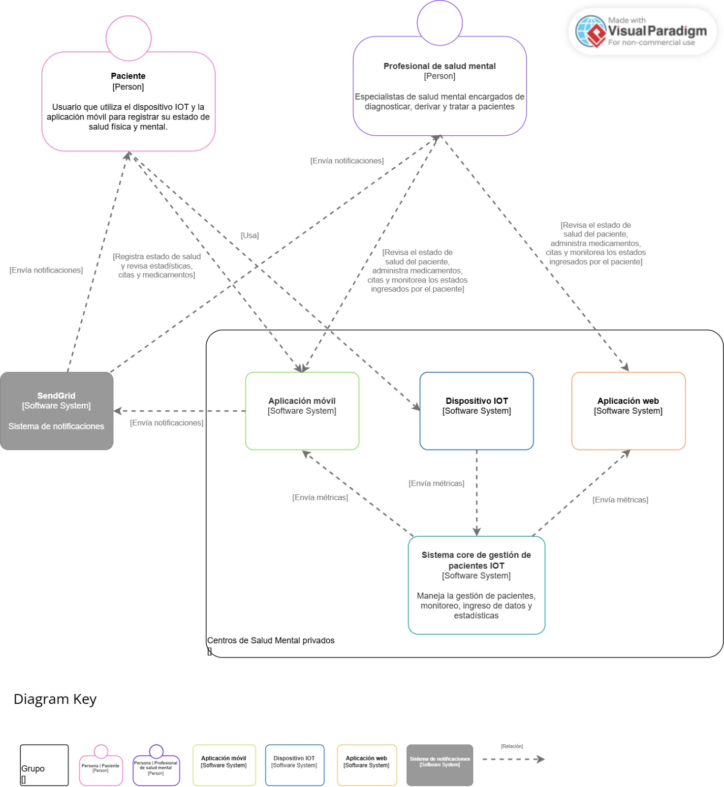
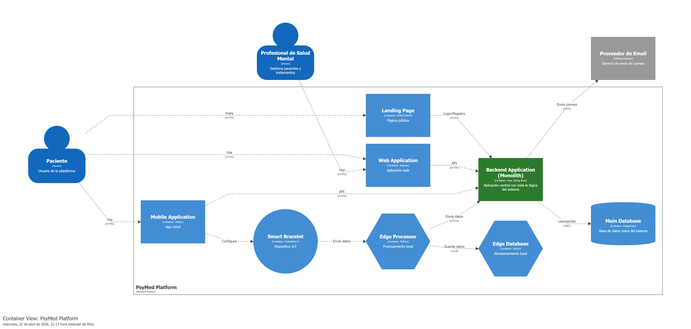

# Capítulo IV: Solution Software Design

## 4.1. Strategic-Level Domain-Driven Design.

El diseño estratégico de dominio permite identificar y delimitar los contextos acotados del sistema mediante técnicas colaborativas como EventStorming, establecer las relaciones entre contextos mediante Context Mapping, y definir la arquitectura de software a nivel estratégico utilizando diagramas C4.

### 4.1.1. Design-Level EventStorming.

EventStorming es una técnica colaborativa utilizada para descubrir el dominio del problema mediante la identificación de eventos de dominio, comandos, agregados y actores. Esta técnica permite visualizar el flujo de eventos en el sistema y establecer los límites naturales entre contextos acotados.

#### 4.1.1.1 Candidate Context Discovery.

Mediante el análisis de eventos y agregados identificados en el EventStorming, se propusieron seis contextos acotados candidatos que agrupan conceptos del dominio relacionados: IAM (Identity and Access Management), Profiles, Clinical History, Appointment and Administration, Medication, y Patient Report. La agrupación se realizó considerando la cohesión funcional y las responsabilidades de cada contexto.

#### 4.1.1.2 Domain Message Flows Modeling.

Los flujos de mensajes del dominio modelan la interacción entre contextos acotados mediante comandos, consultas y eventos. Estos diagramas documentan escenarios clave como la creación de perfiles de paciente, sesiones, asignación de tareas, registro de estados emocionales y asignación de medicamentos, mostrando la comunicación síncrona e asíncrona entre contextos.

#### 4.1.1.3 Bounded Context Canvases.

El Bounded Context Canvas documenta para cada contexto acotado su propósito, estrategia de clasificación, roles del dominio, lenguaje ubicuo, decisiones de negocio, comunicación entrante y saliente, supuestos y métricas de verificación. Estos canvas proporcionan una visión completa de las responsabilidades y relaciones de cada contexto.

### 4.1.2. Context Mapping.

El Context Mapping establece las relaciones entre los contextos acotados identificados. En este sistema, los contextos mantienen relaciones de colaboración y uso mediante comunicaciones síncronas (queries) y asíncronas (eventos). El contexto Profiles actúa como orquestador principal, coordinando la creación de recursos en IAM y Clinical History cuando se crea un perfil de paciente. Los contextos Appointment, Medication y Patient Report dependen de Profiles para validar la existencia de perfiles antes de realizar operaciones.

### 4.1.3. Software Architecture.

La arquitectura de software del sistema se documenta utilizando la metodología C4, que proporciona diferentes niveles de abstracción: Context Level para visualizar el sistema en su entorno, Container Level para mostrar los componentes principales de despliegue, y Deployment Level para representar la infraestructura física de despliegue.

#### 4.1.3.1. Software Architecture System Landscape Diagram.

#### 4.1.3.2. Software Architecture Context Level Diagrams.

#### 4.1.3.2. Software Architecture Container Level Diagrams.

#### 4.1.3.3. Software Architecture Deployment Diagrams.

El diagrama de despliegue muestra la infraestructura física y virtual donde se despliega el sistema. El backend Spring Boot se despliega en Render como servicio web, utilizando Docker Hub para almacenar imágenes de contenedor. La base de datos PostgreSQL se aloja en Neon como base de datos serverless. Las aplicaciones móviles se despliegan en dispositivos Android e iOS de los usuarios.

## 4.2. Tactical-Level Domain-Driven Design

## 4.2.1. Bounded Context: IAM (Identity and Access Management)

### 4.2.1.1. Domain Layer

#### Aggregates

##### Account
- **Propósito**: Representa una cuenta de usuario en el sistema. Es el agregado raíz del contexto IAM que encapsula la información de autenticación y autorización de un usuario.

**Atributos:**
- `userName` (String): Nombre de usuario único en el sistema. Validación: @NotBlank, @Size(max=20), @Column(unique = true)
- `password` (String): Contraseña del usuario. Validación: @NotBlank
- `role` (Roles): Rol del usuario en el sistema. Validación: @Enumerated(EnumType.STRING), @Column(length = 20, nullable = false)
- `profileId` (ProfileId): Identificador del perfil asociado. Tipo: Value Object embebido
- `id` (Long): Identificador único del agregado. Heredado de AuditableAbstractAggregateRoot
- `createdAt` (Date): Fecha de creación. Heredado de AuditableAbstractAggregateRoot
- `updatedAt` (Date): Fecha de última actualización. Heredado de AuditableAbstractAggregateRoot

**Métodos:**
- `Account(SignUpCommand command)`: Constructor que crea una cuenta desde un comando de registro. Valida que el rol sea ROLE_PROFESSIONAL o ROLE_PATIENT
- `Account(SignUpCommand command, String hashedPassword)`: Constructor que crea una cuenta con contraseña ya hasheada
- `getRoleInString()`: Retorna el rol como String
- `getAllRoles()`: Retorna un Set con todos los roles disponibles

**Relaciones:**
- Extiende de `AuditableAbstractAggregateRoot<Account>` para obtener funcionalidades de auditoría
- Tiene una relación con `ProfileId` (Value Object embebido)
- Se relaciona con el enum `Roles` para definir el rol del usuario

#### Value Objects

##### Roles
- **Propósito**: Define los roles disponibles en el sistema.

**Valores:**
- `ROLE_PROFESSIONAL`: Rol para profesionales de la salud
- `ROLE_PATIENT`: Rol para pacientes

**Atributos:** Ninguno (enum)

**Métodos:** Ninguno (enum estándar)

##### ProfileId
- **Propósito**: Representa el identificador de un perfil de forma encapsulada.

**Atributos:**
- `profileId` (Long): Identificador del perfil

**Validaciones:**
- No puede ser null

**Métodos:**
- Constructor con validación de no nulidad

#### Commands

##### SignUpCommand
- **Propósito**: Comando para registrar un nuevo usuario en el sistema.

**Atributos:**
- `username` (String): Nombre de usuario
- `password` (String): Contraseña del usuario
- `role` (String): Rol del usuario (ROLE_PROFESSIONAL o ROLE_PATIENT)

##### SignInCommand
- **Propósito**: Comando para autenticar un usuario existente.

**Atributos:**
- `username` (String): Nombre de usuario
- `password` (String): Contraseña del usuario

##### SeedRolesCommand
- **Propósito**: Comando para inicializar roles en el sistema.

#### Queries

##### GetAccountByIdQuery
- **Propósito**: Consulta para obtener una cuenta por su identificador.

**Atributos:**
- `accountId` (Long): Identificador de la cuenta

#### Domain Services

##### AccountCommandService (Interface)
- **Propósito**: Interfaz que define los servicios de comando para la gestión de cuentas.

**Métodos:**
- `handle(SignUpCommand command)`: Retorna `Optional<Account>`. Procesa el comando de registro de usuario
- `handle(SignInCommand command)`: Retorna `Optional<ImmutablePair<Account, String>>`. Procesa el comando de inicio de sesión y retorna la cuenta con su token

##### AccountQueryService (Interface)
- **Propósito**: Interfaz que define los servicios de consulta para la gestión de cuentas.

**Métodos:**
- `handle(GetAccountByIdQuery query)`: Retorna `Optional<Account>`. Obtiene una cuenta por su identificador

---

### 4.2.1.2. Interface Layer

#### Controllers

##### AuthenticationController
- **Propósito**: Controlador REST que maneja las operaciones de autenticación de usuarios.

**Endpoints:**
- `POST /api/v1/authentication/sign-in`: Autentica un usuario y retorna su cuenta con token JWT
    - Request Body: `SignInResource`
    - Response: `AuthenticatedAccountResource` (200 OK) o 404 Not Found
- `POST /api/v1/authentication/sign-up`: Registra un nuevo usuario en el sistema
    - Request Body: `SignUpResource`
    - Response: `AccountResource` (201 Created) o 400 Bad Request

**Dependencias:**
- `AccountCommandService`: Para procesar los comandos de autenticación

##### AccountsController
- **Propósito**: Controlador REST que maneja las operaciones de consulta de cuentas.

**Endpoints:**
- `GET /api/v1/accounts/{accountId}`: Obtiene una cuenta por su identificador
    - Path Variable: `accountId` (Long)
    - Response: `AccountResource` (200 OK) o 404 Not Found

**Dependencias:**
- `AccountQueryService`: Para procesar las consultas de cuentas

---

### 4.2.1.3. Application Layer

#### Command Handlers

##### AccountCommandServiceImpl
- **Propósito**: Implementación del servicio de comandos de cuenta. Maneja la lógica de registro e inicio de sesión.

**Dependencias:**
- `AccountRepository`: Para acceder a la persistencia de cuentas
- `HashingService`: Para el hashing de contraseñas
- `TokenService`: Para la generación de tokens JWT

**Métodos:**
- `handle(SignUpCommand command)`:
    - Valida que el usuario no exista
    - Hashea la contraseña
    - Crea y persiste la cuenta
    - Retorna `Optional<Account>`
- `handle(SignInCommand command)`:
    - Verifica que el usuario exista
    - Genera un token JWT
    - Retorna `Optional<ImmutablePair<Account, String>>`

#### Query Handlers

##### AccountQueryServiceImpl
- **Propósito**: Implementación del servicio de consultas de cuenta. Maneja la lógica de consulta de cuentas.

**Dependencias:**
- `AccountRepository`: Para acceder a la persistencia de cuentas

**Métodos:**
- `handle(GetAccountByIdQuery query)`: Obtiene una cuenta por su identificador usando el repositorio

---

### 4.2.1.4. Infrastructure Layer

#### Repositories

##### AccountRepository
- **Propósito**: Interfaz de repositorio JPA para la persistencia de cuentas.

**Extiende:** `JpaRepository<Account, Long>`

**Métodos personalizados:**
- `existsByUserName(String username)`: Verifica si existe una cuenta con el nombre de usuario dado
- `findByUserName(String username)`: Busca una cuenta por su nombre de usuario

#### External Services

##### BCryptHashingService
- **Propósito**: Implementación del servicio de hashing de contraseñas usando BCrypt.

**Métodos:**
- `encode(String password)`: Hashea una contraseña usando BCrypt

##### TokenServiceImpl / BearerTokenService
- **Propósito**: Implementación del servicio de generación y validación de tokens JWT.

**Métodos:**
- `generateToken(String username)`: Genera un token JWT para el usuario dado
- `validateToken(String token)`: Valida un token JWT

##### WebSecurityConfiguration
- **Propósito**: Configuración de seguridad de Spring Security.

**Componentes:**
- `BearerAuthorizationRequestFilter`: Filtro que intercepta las peticiones y valida tokens JWT
- `UnauthorizedRequestHandlerEntryPoint`: Maneja las peticiones no autorizadas
- `UserDetailsServiceImpl`: Servicio para cargar detalles de usuario para Spring Security

---

### 4.2.1.5. Bounded Context Software Architecture Component Level Diagrams

### 4.2.1.6. Bounded Context Software Architecture Code Level Diagrams

#### 4.2.1.6.1. Bounded Context Domain Layer Class Diagrams

#### 4.2.1.6.2. Bounded Context Database Design Diagram

---

## 4.2.2. Bounded Context: Profiles

### 4.2.2.1. Domain Layer

#### Aggregates

##### PatientProfile
- **Propósito**: Representa el perfil de un paciente en el sistema. Es el agregado raíz para la gestión de información personal de pacientes.

**Atributos:**
- `personName` (PersonName): Nombre completo del paciente (Value Object embebido)
- `streetAddress` (StreetAddress): Dirección del paciente (Value Object embebido con mapeo personalizado)
- `email` (Email): Correo electrónico del paciente (Value Object embebido)
- `accountId` (AccountId): Identificador de la cuenta asociada (Value Object embebido)
- `professionalId` (Long): Identificador del profesional asignado
- `clinicalHistoryId` (ClinicalHistoryId): Identificador de la historia clínica asociada (Value Object embebido)
- `id` (Long): Identificador único. Heredado de AuditableAbstractAggregateRoot
- `createdAt` (Date): Fecha de creación. Heredado de AuditableAbstractAggregateRoot
- `updatedAt` (Date): Fecha de última actualización. Heredado de AuditableAbstractAggregateRoot

**Métodos:**
- `PatientProfile(String firstName, String lastName, String street, String city, String country, String email)`: Constructor que crea un perfil de paciente desde valores primitivos
- `PatientProfile(CreatePatientProfileCommand command, AccountId accountId)`: Constructor que crea un perfil desde un comando
- `addClinicalHistory(Long id)`: Asocia una historia clínica al perfil
- `updateEmail(String email)`: Actualiza el correo electrónico del paciente
- `updateName(String firstName, String lastName)`: Actualiza el nombre del paciente
- `updateAddress(String street, String city, String country)`: Actualiza la dirección del paciente
- `getFullName()`: Retorna el nombre completo del paciente
- `getStreetAddress()`: Retorna la dirección completa como String
- `getEmail()`: Retorna el correo electrónico
- `getAccountId()`: Retorna el identificador de la cuenta
- `getProfessionalId()`: Retorna el identificador del profesional

**Relaciones:**
- Extiende de `AuditableAbstractAggregateRoot<PatientProfile>` para auditoría
- Tiene relación con `AccountId` (Value Object)
- Tiene relación con `ClinicalHistoryId` (Value Object)
- Se relaciona con múltiples Value Objects: `PersonName`, `StreetAddress`, `Email`

##### ProfessionalProfile
- **Propósito**: Representa el perfil de un profesional de la salud en el sistema. Es el agregado raíz para la gestión de información personal de profesionales.

**Atributos:**
- `personName` (PersonName): Nombre completo del profesional (Value Object embebido)
- `email` (Email): Correo electrónico del profesional (Value Object embebido)
- `accountId` (AccountId): Identificador de la cuenta asociada (Value Object embebido)
- `streetAddress` (StreetAddress): Dirección del profesional (Value Object embebido con mapeo personalizado)
- `id` (Long): Identificador único. Heredado de AuditableAbstractAggregateRoot
- `createdAt` (Date): Fecha de creación. Heredado de AuditableAbstractAggregateRoot
- `updatedAt` (Date): Fecha de última actualización. Heredado de AuditableAbstractAggregateRoot

**Métodos:**
- `ProfessionalProfile(String firstName, String lastName, String street, String city, String country, String email)`: Constructor que crea un perfil de profesional desde valores primitivos
- `ProfessionalProfile(CreateProfessionalProfileCommand command, AccountId accountId)`: Constructor que crea un perfil desde un comando
- `updatePersonName(String firstName, String lastName)`: Actualiza el nombre del profesional
- `updateStreetAddress(String street, String city, String country)`: Actualiza la dirección del profesional
- `getFullName()`: Retorna el nombre completo del profesional
- `getStreetAddress()`: Retorna la dirección completa como String
- `getEmail()`: Retorna el correo electrónico
- `getAccountId()`: Retorna el identificador de la cuenta

**Relaciones:**
- Extiende de `AuditableAbstractAggregateRoot<ProfessionalProfile>` para auditoría
- Tiene relación con `AccountId` (Value Object)
- Se relaciona con múltiples Value Objects: `PersonName`, `StreetAddress`, `Email`

#### Value Objects

##### PersonName
- **Propósito**: Representa el nombre completo de una persona de forma encapsulada.

**Atributos:**
- `firstName` (String): Primer nombre. Validación: No puede ser null o vacío
- `lastName` (String): Apellido. Validación: No puede ser null o vacío

**Métodos:**
- `getFullName()`: Retorna el nombre completo en formato "firstName lastName"

##### Email
- **Propósito**: Representa una dirección de correo electrónico con validación.

**Atributos:**
- `email` (String): Dirección de correo electrónico

**Validaciones:**
- No puede ser null o vacío
- Debe cumplir con el formato de email válido (regex: `^[a-zA-Z0-9+_.-]+@[a-zA-Z0-9.-]+$`)

##### StreetAddress
- **Propósito**: Representa una dirección física completa.

**Atributos:**
- `street` (String): Calle y número
- `city` (String): Ciudad
- `country` (String): País

##### AccountId
- **Propósito**: Representa el identificador de una cuenta de forma encapsulada.

**Atributos:**
- `accountId` (Long): Identificador de la cuenta

##### ClinicalHistoryId
- **Propósito**: Representa el identificador de una historia clínica de forma encapsulada.

**Atributos:**
- `clinicalHistoryId` (Long): Identificador de la historia clínica

#### Commands

##### CreatePatientProfileCommand
- **Propósito**: Comando para crear un nuevo perfil de paciente.

**Atributos:**
- `firstName` (String): Primer nombre
- `lastName` (String): Apellido
- `street` (String): Calle
- `city` (String): Ciudad
- `country` (String): País
- `email` (String): Correo electrónico
- `username` (String): Nombre de usuario
- `password` (String): Contraseña
- `professionalId` (Long): Identificador del profesional asignado

##### UpdatePatientProfileCommand
- **Propósito**: Comando para actualizar un perfil de paciente existente.

**Atributos:**
- `profileId` (Long): Identificador del perfil
- `firstName` (String): Primer nombre (opcional)
- `lastName` (String): Apellido (opcional)
- `email` (String): Correo electrónico (opcional)
- `street` (String): Calle (opcional)
- `city` (String): Ciudad (opcional)
- `country` (String): País (opcional)

##### DeletePatientProfileCommand
- **Propósito**: Comando para eliminar un perfil de paciente.

**Atributos:**
- `profileId` (Long): Identificador del perfil a eliminar

##### CreateProfessionalProfileCommand
- **Propósito**: Comando para crear un nuevo perfil de profesional.

**Atributos:**
- `firstName` (String): Primer nombre
- `lastName` (String): Apellido
- `street` (String): Calle
- `city` (String): Ciudad
- `country` (String): País
- `email` (String): Correo electrónico
- `username` (String): Nombre de usuario
- `password` (String): Contraseña

##### UpdateProfessionalProfileCommand
- **Propósito**: Comando para actualizar un perfil de profesional existente.

**Atributos:**
- `profileId` (Long): Identificador del perfil
- `firstName` (String): Primer nombre (opcional)
- `lastName` (String): Apellido (opcional)
- `email` (String): Correo electrónico (opcional)
- `street` (String): Calle (opcional)
- `city` (String): Ciudad (opcional)
- `country` (String): País (opcional)

##### DeleteProfessionalProfileCommand
- **Propósito**: Comando para eliminar un perfil de profesional.

**Atributos:**
- `profileId` (Long): Identificador del perfil a eliminar

#### Queries

##### GetPatientProfileByIdQuery
- **Propósito**: Consulta para obtener un perfil de paciente por su identificador.

**Atributos:**
- `profileId` (Long): Identificador del perfil

##### GetPatientProfileByAccountIdQuery
- **Propósito**: Consulta para obtener un perfil de paciente por el identificador de su cuenta.

**Atributos:**
- `accountId` (AccountId): Identificador de la cuenta

##### GetPatientProfileByProfessionalIdQuery
- **Propósito**: Consulta para obtener todos los perfiles de pacientes asignados a un profesional.

**Atributos:**
- `professionalId` (Long): Identificador del profesional

##### GetAllPatientProfilesQuery
- **Propósito**: Consulta para obtener todos los perfiles de pacientes del sistema.

**Atributos:** Ninguno

##### GetProfessionalProfileByIdQuery
- **Propósito**: Consulta para obtener un perfil de profesional por su identificador.

**Atributos:**
- `profileId` (Long): Identificador del perfil

##### GetProfessionalProfileByAccountIdQuery
- **Propósito**: Consulta para obtener un perfil de profesional por el identificador de su cuenta.

**Atributos:**
- `accountId` (AccountId): Identificador de la cuenta

#### Domain Services

##### PatientProfileCommandService (Interface)
- **Propósito**: Interfaz que define los servicios de comando para la gestión de perfiles de pacientes.

**Métodos:**
- `handle(CreatePatientProfileCommand command)`: Retorna `Optional<PatientProfile>`. Crea un nuevo perfil de paciente
- `handle(UpdatePatientProfileCommand command)`: Retorna `Optional<PatientProfile>`. Actualiza un perfil de paciente existente
- `handle(DeletePatientProfileCommand command)`: Elimina un perfil de paciente

##### PatientProfileQueryService (Interface)
- **Propósito**: Interfaz que define los servicios de consulta para la gestión de perfiles de pacientes.

**Métodos:**
- `handle(GetPatientProfileByIdQuery query)`: Retorna `Optional<PatientProfile>`. Obtiene un perfil por su identificador
- `handle(GetPatientProfileByAccountIdQuery query)`: Retorna `Optional<PatientProfile>`. Obtiene un perfil por el identificador de cuenta
- `handle(GetPatientProfileByProfessionalIdQuery query)`: Retorna `List<PatientProfile>`. Obtiene todos los perfiles de un profesional
- `handle(GetAllPatientProfilesQuery query)`: Retorna `List<PatientProfile>`. Obtiene todos los perfiles de pacientes

##### ProfessionalProfileCommandService (Interface)
- **Propósito**: Interfaz que define los servicios de comando para la gestión de perfiles de profesionales.

**Métodos:**
- `handle(CreateProfessionalProfileCommand command)`: Retorna `Optional<ProfessionalProfile>`. Crea un nuevo perfil de profesional
- `handle(UpdateProfessionalProfileCommand command)`: Retorna `Optional<ProfessionalProfile>`. Actualiza un perfil de profesional existente
- `handle(DeleteProfessionalProfileCommand command)`: Elimina un perfil de profesional

##### ProfessionalProfileQueryService (Interface)
- **Propósito**: Interfaz que define los servicios de consulta para la gestión de perfiles de profesionales.

**Métodos:**
- `handle(GetProfessionalProfileByIdQuery query)`: Retorna `Optional<ProfessionalProfile>`. Obtiene un perfil por su identificador
- `handle(GetProfessionalProfileByAccountIdQuery query)`: Retorna `Optional<ProfessionalProfile>`. Obtiene un perfil por el identificador de cuenta

---

### 4.2.2.2. Interface Layer

#### Controllers

##### PatientProfileController
- **Propósito**: Controlador REST que maneja las operaciones de gestión de perfiles de pacientes.

**Endpoints:**
- `POST /api/v1/patient-profiles`: Crea un nuevo perfil de paciente
    - Request Body: `CreatePatientProfileResource`
    - Response: `ProfileResource` (201 Created) o 400 Bad Request
- `GET /api/v1/patient-profiles/{profileId}`: Obtiene un perfil por su identificador
    - Path Variable: `profileId` (Long)
    - Response: `ProfileResource` (200 OK) o 404 Not Found
- `GET /api/v1/patient-profiles/account/{accountId}`: Obtiene un perfil por el identificador de cuenta
    - Path Variable: `accountId` (Long)
    - Response: `ProfileResource` (200 OK) o 404 Not Found
- `GET /api/v1/patient-profiles/professional/{professionalId}`: Obtiene todos los perfiles asignados a un profesional
    - Path Variable: `professionalId` (Long)
    - Response: `List<ProfileResource>` (200 OK) o 404 Not Found
- `GET /api/v1/patient-profiles`: Obtiene todos los perfiles de pacientes
    - Response: `List<ProfileResource>` (200 OK)
- `PUT /api/v1/patient-profiles/{profileId}`: Actualiza un perfil de paciente
    - Path Variable: `profileId` (Long)
    - Request Body: `UpdatePatientProfileResource`
    - Response: `ProfileResource` (200 OK) o 400 Bad Request
- `DELETE /api/v1/patient-profiles/{profileId}`: Elimina un perfil de paciente
    - Path Variable: `profileId` (Long)
    - Response: 204 No Content

**Dependencias:**
- `PatientProfileCommandService`: Para procesar comandos
- `PatientProfileQueryService`: Para procesar consultas

##### ProfessionalProfileController
- **Propósito**: Controlador REST que maneja las operaciones de gestión de perfiles de profesionales.

**Endpoints:**
- `POST /api/v1/professional-profiles`: Crea un nuevo perfil de profesional
    - Request Body: `CreateProfessionalProfileResource`
    - Response: `ProfileResource` (201 Created) o 400 Bad Request
- `GET /api/v1/professional-profiles/{profileId}`: Obtiene un perfil por su identificador
    - Path Variable: `profileId` (Long)
    - Response: `ProfileResource` (200 OK) o 404 Not Found
- `GET /api/v1/professional-profiles/account/{accountId}`: Obtiene un perfil por el identificador de cuenta
    - Path Variable: `accountId` (Long)
    - Response: `ProfileResource` (200 OK) o 404 Not Found

**Dependencias:**
- `ProfessionalProfileCommandService`: Para procesar comandos
- `ProfessionalProfileQueryService`: Para procesar consultas

##### PatientClinicalHistoryController
- **Propósito**: Controlador REST que maneja las consultas relacionadas con historias clínicas de pacientes.

**Endpoints:**
- `GET /api/v1/patient-profiles/{patientId}/clinical-histories`: Obtiene la historia clínica de un paciente
    - Path Variable: `patientId` (Long)
    - Response: `ClinicalHistoryResource` (200 OK) o 404 Not Found

**Dependencias:**
- `ClinicalHistoryQueryService`: Para procesar consultas de historias clínicas

#### ACL (Application Context Layer)

##### ProfilesContextFacade (Interface)
- **Propósito**: Facade que permite a otros bounded contexts interactuar con el contexto de Profiles.

**Métodos:**
- `verifyPatientProfile(Long patientId)`: Verifica si existe un perfil de paciente
- `verifyProfessionalProfile(Long professionalId)`: Verifica si existe un perfil de profesional
- `fetchClinicalHistoryIdByPatientId(Long patientId)`: Obtiene el identificador de historia clínica de un paciente

---

### 4.2.2.3. Application Layer

#### Command Handlers

##### PatientProfileCommandServiceImpl
- **Propósito**: Implementación del servicio de comandos de perfil de paciente. Maneja la lógica de creación, actualización y eliminación de perfiles de pacientes.

**Dependencias:**
- `PatientProfileRepository`: Para acceder a la persistencia
- `ExternalAccountService`: Para crear cuentas en el contexto IAM
- `ExternalClinicalHistoryService`: Para crear historias clínicas
- `ProfilesContextFacade`: Para validaciones internas

**Métodos:**
- `handle(CreatePatientProfileCommand command)`:
    - Crea una cuenta en el contexto IAM
    - Crea una historia clínica
    - Crea y persiste el perfil de paciente
    - Asocia la historia clínica al perfil
    - Retorna `Optional<PatientProfile>`
- `handle(UpdatePatientProfileCommand command)`: Actualiza un perfil existente
- `handle(DeletePatientProfileCommand command)`: Elimina un perfil

##### ProfessionalProfileCommandServiceImpl
- **Propósito**: Implementación del servicio de comandos de perfil de profesional. Maneja la lógica de creación, actualización y eliminación de perfiles de profesionales.

**Dependencias:**
- `ProfessionalProfileRepository`: Para acceder a la persistencia
- `ExternalAccountService`: Para crear cuentas en el contexto IAM

**Métodos:**
- `handle(CreateProfessionalProfileCommand command)`: Crea un nuevo perfil de profesional
- `handle(UpdateProfessionalProfileCommand command)`: Actualiza un perfil existente
- `handle(DeleteProfessionalProfileCommand command)`: Elimina un perfil

#### Query Handlers

##### PatientProfileQueryServiceImpl
- **Propósito**: Implementación del servicio de consultas de perfil de paciente.

**Dependencias:**
- `PatientProfileRepository`: Para acceder a la persistencia

**Métodos:**
- `handle(GetPatientProfileByIdQuery query)`: Obtiene un perfil por ID
- `handle(GetPatientProfileByAccountIdQuery query)`: Obtiene un perfil por AccountId
- `handle(GetPatientProfileByProfessionalIdQuery query)`: Obtiene todos los perfiles de un profesional
- `handle(GetAllPatientProfilesQuery query)`: Obtiene todos los perfiles

##### ProfessionalProfileQueryServiceImpl
- **Propósito**: Implementación del servicio de consultas de perfil de profesional.

**Dependencias:**
- `ProfessionalProfileRepository`: Para acceder a la persistencia

**Métodos:**
- `handle(GetProfessionalProfileByIdQuery query)`: Obtiene un perfil por ID
- `handle(GetProfessionalProfileByAccountIdQuery query)`: Obtiene un perfil por AccountId

#### Outbound Services

##### ExternalAccountService
- **Propósito**: Servicio para interactuar con el contexto IAM para crear cuentas.

**Métodos:**
- `createAccount(String username, String password, String role)`: Crea una cuenta en el contexto IAM

##### ExternalClinicalHistoryService
- **Propósito**: Servicio para interactuar con el contexto Clinical History para crear historias clínicas.

**Métodos:**
- `createClinicalHistory(String background, String consultationReason, LocalDate consultationDate)`: Crea una historia clínica

---

### 4.2.2.4. Infrastructure Layer

#### Repositories

##### PatientProfileRepository
- **Propósito**: Interfaz de repositorio JPA para la persistencia de perfiles de pacientes.

**Extiende:** `JpaRepository<PatientProfile, Long>`

**Métodos personalizados:**
- `existsByEmail(Email emailAddress)`: Verifica si existe un perfil con el email dado
- `findByEmail(Email email)`: Busca un perfil por email
- `findByAccountId(AccountId accountId)`: Busca un perfil por AccountId
- `findClinicalHistoryIdById(Long patientId)`: Obtiene el ID de historia clínica de un paciente
- `findByProfessionalId(Long professionalId)`: Busca todos los perfiles de un profesional

##### ProfessionalProfileRepository
- **Propósito**: Interfaz de repositorio JPA para la persistencia de perfiles de profesionales.

**Extiende:** `JpaRepository<ProfessionalProfile, Long>`

**Métodos personalizados:**
- `existsByEmail(Email emailAddress)`: Verifica si existe un perfil con el email dado
- `findByEmail(Email email)`: Busca un perfil por email
- `findByAccountId(AccountId accountId)`: Busca un perfil por AccountId

---

### 4.2.2.5. Bounded Context Software Architecture Component Level Diagrams

### 4.2.4.2. Bounded Context Software Architecture Code Level Diagrams

#### 4.2.4.2.1. Bounded Context Domain Layer Class Diagrams

#### 4.2.4.2.2. Bounded Context Database Design Diagram

---

## 4.2.3. Bounded Context: Appointment and Administration

### 4.2.3.1. Domain Layer

#### Aggregates

##### Session
- **Propósito**: Representa una sesión de atención entre un paciente y un profesional. Es el agregado raíz que encapsula la gestión de citas, notas y tareas.

**Atributos:**
- `id` (Long): Identificador único de la sesión
- `patientId` (PatientId): Identificador del paciente (Value Object embebido)
- `professionalId` (ProfessionalId): Identificador del profesional (Value Object embebido)
- `appointmentDate` (AppointmentDate): Fecha de la cita (Value Object embebido)
- `sessionTime` (SessionTime): Duración de la sesión en horas (Value Object embebido)
- `note` (Note): Nota asociada a la sesión (Entity, relación OneToOne)
- `tasks` (List<Task>): Lista de tareas asociadas a la sesión (Entity, relación OneToMany)
- `createdAt` (Date): Fecha de creación
- `updatedAt` (Date): Fecha de última actualización

**Métodos:**
- `Session(CreateSessionCommand command)`: Constructor que crea una sesión desde un comando
- `addNoteToSession(String title, String description)`: Agrega una nota a la sesión
- `addTaskToSession(String title, String description)`: Agrega una tarea a la sesión
- `getLastTask()`: Obtiene la última tarea agregada. Lanza excepción si no hay tareas
- `getTaskById(Long taskId)`: Obtiene una tarea por su identificador. Lanza excepción si no existe
- `updateTask(Long taskId, String title, String description)`: Actualiza una tarea existente
- `deleteTask(Long taskId)`: Elimina una tarea de la sesión
- `deleteNote()`: Elimina la nota de la sesión
- `reschedule(Date newAppointmentDate, double newSessionTime)`: Reprograma la sesión con nueva fecha y duración

**Relaciones:**
- Tiene una relación OneToOne con `Note`
- Tiene una relación OneToMany con `Task`
- Usa múltiples Value Objects: `PatientId`, `ProfessionalId`, `AppointmentDate`, `SessionTime`

#### Entities

##### Task
- **Propósito**: Representa una tarea asignada a un paciente dentro de una sesión.

**Atributos:**
- `id` (Long): Identificador único de la tarea
- `title` (String): Título de la tarea
- `description` (String): Descripción de la tarea
- `status` (TaskStatus): Estado de la tarea (Value Object embebido: INCOMPLETE=0, COMPLETE=1)
- `session` (Session): Sesión a la que pertenece la tarea (relación ManyToOne)
- `createdAt` (Date): Fecha de creación. Heredado de AuditableModel
- `updatedAt` (Date): Fecha de última actualización. Heredado de AuditableModel

**Métodos:**
- `Task(Session session, String title, String description)`: Constructor que crea una tarea asociada a una sesión
- `completeTask()`: Marca la tarea como completada
- `incompleteTask()`: Marca la tarea como incompleta
- `updateTask(String title, String description)`: Actualiza el título y/o descripción de la tarea

**Relaciones:**
- Extiende de `AuditableModel` para auditoría
- Tiene una relación ManyToOne con `Session`
- Usa el Value Object `TaskStatus`

##### Note
- **Propósito**: Representa una nota privada asociada a una sesión, visible solo para el profesional.

**Atributos:**
- `id` (Long): Identificador único de la nota
- `title` (String): Título de la nota. Validación: @NotNull
- `description` (String): Descripción o contenido de la nota. Validación: @NotNull
- `createdAt` (Date): Fecha de creación. Heredado de AuditableModel
- `updatedAt` (Date): Fecha de última actualización. Heredado de AuditableModel

**Métodos:**
- `Note(String title, String description)`: Constructor que crea una nota
- `updateNote(String title, String description)`: Actualiza el título y/o descripción de la nota

**Relaciones:**
- Extiende de `AuditableModel` para auditoría
- Tiene una relación OneToOne con `Session` (desde la perspectiva de Session)

#### Value Objects

##### PatientId
- **Propósito**: Representa el identificador de un paciente de forma encapsulada.

**Atributos:**
- `patientId` (Long): Identificador del paciente

##### ProfessionalId
- **Propósito**: Representa el identificador de un profesional de forma encapsulada.

**Atributos:**
- `professionalId` (Long): Identificador del profesional

##### AppointmentDate
- **Propósito**: Representa la fecha de una cita con validaciones.

**Atributos:**
- `appointmentDate` (Date): Fecha de la cita

##### SessionTime
- **Propósito**: Representa la duración de una sesión en horas.

**Atributos:**
- `sessionTime` (double): Duración de la sesión en horas

##### TaskStatus
- **Propósito**: Representa el estado de una tarea.

**Valores:**
- `INCOMPLETE` (0): Tarea incompleta
- `COMPLETE` (1): Tarea completada

**Métodos:**
- `changeToCompleted()`: Cambia el estado a completado
- `changeToIncomplete()`: Cambia el estado a incompleto

#### Commands

##### CreateSessionCommand
- **Propósito**: Comando para crear una nueva sesión.

**Atributos:**
- `patientId` (Long): Identificador del paciente
- `professionalId` (Long): Identificador del profesional
- `appointmentDate` (Date): Fecha de la cita
- `sessionTime` (double): Duración de la sesión

##### UpdateSessionCommand
- **Propósito**: Comando para actualizar una sesión existente.

**Atributos:**
- `sessionId` (Long): Identificador de la sesión
- `patientId` (Long): Identificador del paciente
- `professionalId` (Long): Identificador del profesional
- `appointmentDate` (Date): Nueva fecha de la cita
- `sessionTime` (double): Nueva duración de la sesión

##### DeleteSessionCommand
- **Propósito**: Comando para eliminar una sesión.

**Atributos:**
- `sessionId` (Long): Identificador de la sesión
- `patientId` (Long): Identificador del paciente
- `professionalId` (Long): Identificador del profesional

##### CreateTaskCommand
- **Propósito**: Comando para crear una nueva tarea en una sesión.

**Atributos:**
- `sessionId` (Long): Identificador de la sesión
- `title` (String): Título de la tarea
- `description` (String): Descripción de la tarea

##### UpdateTaskCommand
- **Propósito**: Comando para actualizar una tarea existente.

**Atributos:**
- `sessionId` (Long): Identificador de la sesión
- `taskId` (Long): Identificador de la tarea
- `title` (String): Nuevo título
- `description` (String): Nueva descripción

##### DeleteTaskCommand
- **Propósito**: Comando para eliminar una tarea.

**Atributos:**
- `sessionId` (Long): Identificador de la sesión
- `taskId` (Long): Identificador de la tarea

##### UpdateTaskStatusToCompleteCommand
- **Propósito**: Comando para marcar una tarea como completada.

**Atributos:**
- `sessionId` (Long): Identificador de la sesión
- `taskId` (Long): Identificador de la tarea

##### UpdateTaskStatusToIncompleteCommand
- **Propósito**: Comando para marcar una tarea como incompleta.

**Atributos:**
- `sessionId` (Long): Identificador de la sesión
- `taskId` (Long): Identificador de la tarea

##### CreateNoteCommand
- **Propósito**: Comando para crear una nota en una sesión.

**Atributos:**
- `sessionId` (Long): Identificador de la sesión
- `title` (String): Título de la nota
- `description` (String): Descripción de la nota

##### UpdateNoteCommand
- **Propósito**: Comando para actualizar una nota existente.

**Atributos:**
- `sessionId` (Long): Identificador de la sesión
- `title` (String): Nuevo título
- `description` (String): Nueva descripción

##### DeleteNoteFromSessionCommand
- **Propósito**: Comando para eliminar una nota de una sesión.

**Atributos:**
- `sessionId` (Long): Identificador de la sesión

#### Queries

##### GetAllSessionsByPatientIdQuery
- **Propósito**: Consulta para obtener todas las sesiones de un paciente.

**Atributos:**
- `patientId` (PatientId): Identificador del paciente

##### GetAllSessionsByProfessionalIdQuery
- **Propósito**: Consulta para obtener todas las sesiones de un profesional.

**Atributos:**
- `professionalId` (ProfessionalId): Identificador del profesional

##### GetSessionByIdQuery
- **Propósito**: Consulta para obtener una sesión por su identificador.

**Atributos:**
- `sessionId` (Long): Identificador de la sesión
- `patientId` (Long): Identificador del paciente
- `professionalId` (Long): Identificador del profesional

##### GetAllTasksByPatientIdQuery
- **Propósito**: Consulta para obtener todas las tareas de un paciente.

**Atributos:**
- `patientId` (Long): Identificador del paciente

##### GetAllTasksBySessionIdQuery
- **Propósito**: Consulta para obtener todas las tareas de una sesión.

**Atributos:**
- `sessionId` (Long): Identificador de la sesión

##### GetNoteBySessionIdQuery
- **Propósito**: Consulta para obtener la nota de una sesión.

**Atributos:**
- `sessionId` (Long): Identificador de la sesión

#### Domain Services

##### SessionCommandService (Interface)
- **Propósito**: Interfaz que define los servicios de comando para la gestión de sesiones.

**Métodos:**
- `handle(CreateSessionCommand command)`: Retorna `Optional<Session>`. Crea una nueva sesión
- `handle(UpdateSessionCommand command)`: Retorna `Optional<Session>`. Actualiza una sesión existente
- `handle(DeleteSessionCommand command)`: Elimina una sesión
- `handle(CreateTaskCommand command)`: Retorna `Optional<Task>`. Crea una nueva tarea
- `handle(UpdateTaskCommand command)`: Retorna `Optional<Task>`. Actualiza una tarea
- `handle(DeleteTaskCommand command)`: Elimina una tarea
- `handle(UpdateTaskStatusToCompleteCommand command)`: Marca una tarea como completada
- `handle(UpdateTaskStatusToIncompleteCommand command)`: Marca una tarea como incompleta
- `handle(CreateNoteCommand command)`: Retorna `Optional<Note>`. Crea una nueva nota
- `handle(UpdateNoteCommand command)`: Retorna `Optional<Note>`. Actualiza una nota
- `handle(DeleteNoteFromSessionCommand command)`: Elimina una nota

##### SessionQueryService (Interface)
- **Propósito**: Interfaz que define los servicios de consulta para la gestión de sesiones.

**Métodos:**
- `handle(GetAllSessionsByPatientIdQuery query)`: Retorna `List<Session>`. Obtiene todas las sesiones de un paciente
- `handle(GetAllSessionsByProfessionalIdQuery query)`: Retorna `List<Session>`. Obtiene todas las sesiones de un profesional
- `handle(GetSessionByIdQuery query)`: Retorna `Optional<Session>`. Obtiene una sesión por ID
- `handle(GetAllTasksByPatientIdQuery query)`: Retorna `List<Task>`. Obtiene todas las tareas de un paciente
- `handle(GetAllTasksBySessionIdQuery query)`: Retorna `List<Task>`. Obtiene todas las tareas de una sesión
- `handle(GetNoteBySessionIdQuery query)`: Retorna `Optional<Note>`. Obtiene la nota de una sesión

#### Domain Exceptions

##### PatientNotFoundException
- **Propósito**: Excepción lanzada cuando no se encuentra un paciente.

##### ProfessionalNotFoundException
- **Propósito**: Excepción lanzada cuando no se encuentra un profesional.

---

### 4.2.3.2. Interface Layer

#### Controllers

##### SessionReservationController
- **Propósito**: Controlador REST que maneja las operaciones de reserva de sesiones para profesionales.

**Endpoints:**
- `POST /api/v1/professionals/{professionalId}/patients/{patientId}/sessions`: Crea una nueva sesión
    - Path Variables: `professionalId` (Long), `patientId` (Long)
    - Request Body: `CreateSessionResource`
    - Response: `SessionResource` (201 Created) o 400 Bad Request
- `PUT /api/v1/professionals/{professionalId}/patients/{patientId}/sessions/{sessionId}`: Actualiza una sesión
    - Path Variables: `professionalId` (Long), `patientId` (Long), `sessionId` (Long)
    - Request Body: `UpdateSessionResource`
    - Response: `SessionResource` (200 OK), 404 Not Found, o 400 Bad Request
- `DELETE /api/v1/professionals/{professionalId}/patients/{patientId}/sessions/{sessionId}`: Elimina una sesión
    - Path Variables: `professionalId` (Long), `patientId` (Long), `sessionId` (Long)
    - Response: 204 No Content, 404 Not Found, o 400 Bad Request

**Dependencias:**
- `SessionCommandService`: Para procesar comandos
- `SessionQueryService`: Para procesar consultas

##### PatientSessionController
- **Propósito**: Controlador REST que maneja las operaciones de sesiones para pacientes.

**Endpoints:**
- `GET /api/v1/patients/{patientId}/sessions`: Obtiene todas las sesiones de un paciente
    - Path Variable: `patientId` (Long)
    - Response: `List<SessionResource>` (200 OK)
- `GET /api/v1/patients/{patientId}/tasks`: Obtiene todas las tareas de un paciente
    - Path Variable: `patientId` (Long)
    - Response: `List<TaskResource>` (200 OK)

**Dependencias:**
- `SessionQueryService`: Para procesar consultas

##### ProfessionalSessionController
- **Propósito**: Controlador REST que maneja las operaciones de sesiones para profesionales.

**Endpoints:**
- `GET /api/v1/professionals/{professionalId}/sessions`: Obtiene todas las sesiones de un profesional
    - Path Variable: `professionalId` (Long)
    - Response: `List<SessionResource>` (200 OK)

**Dependencias:**
- `SessionQueryService`: Para procesar consultas

##### SessionToolsController
- **Propósito**: Controlador REST que maneja las operaciones de tareas y notas de sesiones.

**Endpoints:**
- `POST /api/v1/sessions/{sessionId}/tasks`: Crea una nueva tarea en una sesión
    - Path Variable: `sessionId` (Long)
    - Request Body: `CreateTaskResource`
    - Response: `TaskResource` (201 Created) o 400 Bad Request
- `GET /api/v1/sessions/{sessionId}/tasks`: Obtiene todas las tareas de una sesión
    - Path Variable: `sessionId` (Long)
    - Response: `List<TaskResource>` (200 OK)
- `PUT /api/v1/sessions/{sessionId}/tasks/{taskId}`: Actualiza una tarea
    - Path Variables: `sessionId` (Long), `taskId` (Long)
    - Request Body: `UpdateTaskResource`
    - Response: `TaskResource` (200 OK) o 400 Bad Request
- `DELETE /api/v1/sessions/{sessionId}/tasks/{taskId}`: Elimina una tarea
    - Path Variables: `sessionId` (Long), `taskId` (Long)
    - Response: 204 No Content
- `POST /api/v1/sessions/{sessionId}/tasks/{taskId}/complete`: Marca una tarea como completada
    - Path Variables: `sessionId` (Long), `taskId` (Long)
    - Response: `TaskResource` (200 OK)
- `POST /api/v1/sessions/{sessionId}/tasks/{taskId}/incomplete`: Marca una tarea como incompleta
    - Path Variables: `sessionId` (Long), `taskId` (Long)
    - Response: `TaskResource` (200 OK)
- `POST /api/v1/sessions/{sessionId}/notes`: Crea una nueva nota en una sesión
    - Path Variable: `sessionId` (Long)
    - Request Body: `CreateNoteResource`
    - Response: `NoteResource` (201 Created) o 400 Bad Request
- `GET /api/v1/sessions/{sessionId}/notes`: Obtiene la nota de una sesión
    - Path Variable: `sessionId` (Long)
    - Response: `NoteResource` (200 OK) o 404 Not Found
- `PUT /api/v1/sessions/{sessionId}/notes`: Actualiza una nota
    - Path Variable: `sessionId` (Long)
    - Request Body: `UpdateNoteResource`
    - Response: `NoteResource` (200 OK) o 400 Bad Request
- `DELETE /api/v1/sessions/{sessionId}/notes`: Elimina una nota
    - Path Variable: `sessionId` (Long)
    - Response: 204 No Content

**Dependencias:**
- `SessionCommandService`: Para procesar comandos
- `SessionQueryService`: Para procesar consultas

---

### 4.2.3.3. Application Layer

#### Command Handlers

##### SessionCommandServiceImpl
- **Propósito**: Implementación del servicio de comandos de sesión. Maneja la lógica de creación, actualización y eliminación de sesiones, tareas y notas.

**Dependencias:**
- `SessionRepository`: Para acceder a la persistencia
- `AppointmentVersionOfExternalProfileService`: Para validar existencia de perfiles

**Métodos:**
- `handle(CreateSessionCommand command)`:
    - Valida que existan el paciente y profesional
    - Crea y persiste la sesión
    - Retorna `Optional<Session>`
- `handle(UpdateSessionCommand command)`: Actualiza una sesión existente
- `handle(DeleteSessionCommand command)`: Elimina una sesión
- `handle(CreateTaskCommand command)`: Crea una tarea en una sesión
- `handle(UpdateTaskCommand command)`: Actualiza una tarea
- `handle(DeleteTaskCommand command)`: Elimina una tarea
- `handle(UpdateTaskStatusToCompleteCommand command)`: Marca una tarea como completada
- `handle(UpdateTaskStatusToIncompleteCommand command)`: Marca una tarea como incompleta
- `handle(CreateNoteCommand command)`: Crea una nota en una sesión
- `handle(UpdateNoteCommand command)`: Actualiza una nota
- `handle(DeleteNoteFromSessionCommand command)`: Elimina una nota

#### Query Handlers

##### SessionQueryServiceImpl
- **Propósito**: Implementación del servicio de consultas de sesión.

**Dependencias:**
- `SessionRepository`: Para acceder a la persistencia

**Métodos:**
- `handle(GetAllSessionsByPatientIdQuery query)`: Obtiene todas las sesiones de un paciente
- `handle(GetAllSessionsByProfessionalIdQuery query)`: Obtiene todas las sesiones de un profesional
- `handle(GetSessionByIdQuery query)`: Obtiene una sesión por ID
- `handle(GetAllTasksByPatientIdQuery query)`: Obtiene todas las tareas de un paciente
- `handle(GetAllTasksBySessionIdQuery query)`: Obtiene todas las tareas de una sesión
- `handle(GetNoteBySessionIdQuery query)`: Obtiene la nota de una sesión

#### Outbound Services

##### AppointmentVersionOfExternalProfileService
- **Propósito**: Servicio para validar la existencia de perfiles de paciente y profesional.

**Métodos:**
- `verifyPatientProfile(Long patientId)`: Verifica si existe un perfil de paciente
- `verifyProfessionalProfile(Long professionalId)`: Verifica si existe un perfil de profesional

---

### 4.2.3.4. Infrastructure Layer

#### Repositories

##### SessionRepository
- **Propósito**: Interfaz de repositorio JPA para la persistencia de sesiones.

**Extiende:** `JpaRepository<Session, Long>`

**Métodos personalizados:**
- `findAllByPatientId(PatientId patientId)`: Busca todas las sesiones de un paciente
- `findAllByProfessionalId(ProfessionalId professionalId)`: Busca todas las sesiones de un profesional
- `findByPatientIdAndId(PatientId patientId, Long sessionId)`: Busca una sesión específica por paciente e ID
- `existsByNote(Note note)`: Verifica si existe una sesión con la nota dada

---

### 4.2.3.5. Bounded Context Software Architecture Component Level Diagrams

### 4.2.3.6. Bounded Context Software Architecture Code Level Diagrams

#### 4.2.3.6.1. Bounded Context Domain Layer Class Diagrams

#### 4.2.3.6.2. Bounded Context Database Design Diagram

---

## 4.2.4. Bounded Context: Medication

### 4.2.4.1. Domain Layer

#### Aggregates

##### Pills
- **Propósito**: Representa un registro de medicación (píldora) asignado a un paciente. Es el agregado raíz para la gestión de medicamentos.

**Atributos:**
- `id` (Long): Identificador único del medicamento
- `name` (String): Nombre del medicamento
- `description` (String): Descripción del medicamento
- `patientId` (Long): Identificador del paciente al que está asignado
- `interval` (String): Intervalo de dosificación (alias: `dosage` en base de datos)
- `quantity` (String): Cantidad del medicamento
- `createdAt` (Date): Fecha de creación. Heredado de AuditableAbstractAggregateRoot
- `updatedAt` (Date): Fecha de última actualización. Heredado de AuditableAbstractAggregateRoot

**Métodos:**
- `Pills(String name, String description)`: Constructor básico que crea un medicamento con nombre y descripción
- `Pills(CreatePillsCommand command)`: Constructor que crea un medicamento desde un comando
- `updateInformation(String name, String description, String interval, String quantity)`: Actualiza la información del medicamento. Retorna `Pills`

**Relaciones:**
- Extiende de `AuditableAbstractAggregateRoot<Pills>` para auditoría
- Tiene una relación implícita con `PatientProfile` a través de `patientId`

#### Commands

##### CreatePillsCommand
- **Propósito**: Comando para crear un nuevo registro de medicación.

**Atributos:**
- `name` (String): Nombre del medicamento
- `description` (String): Descripción del medicamento
- `patientId` (Long): Identificador del paciente
- `interval` (String): Intervalo de dosificación
- `quantity` (String): Cantidad del medicamento

##### UpdatePillCommand
- **Propósito**: Comando para actualizar un registro de medicación existente.

**Atributos:**
- `pillId` (Long): Identificador del medicamento
- `name` (String): Nuevo nombre (opcional)
- `description` (String): Nueva descripción (opcional)
- `interval` (String): Nuevo intervalo (opcional)
- `quantity` (String): Nueva cantidad (opcional)

##### DeletePillsCommand
- **Propósito**: Comando para eliminar un registro de medicación.

**Atributos:**
- `pillId` (Long): Identificador del medicamento a eliminar

#### Queries

##### GetAllPillsQuery
- **Propósito**: Consulta para obtener todos los registros de medicación del sistema.

**Atributos:** Ninguno

##### GetPillsByIdQuery
- **Propósito**: Consulta para obtener un registro de medicación por su identificador.

**Atributos:**
- `pillId` (Long): Identificador del medicamento

##### GetPillsByPatientId
- **Propósito**: Consulta para obtener todos los registros de medicación de un paciente.

**Atributos:**
- `patientId` (Long): Identificador del paciente

#### Domain Services

##### PillCommandService (Interface)
- **Propósito**: Interfaz que define los servicios de comando para la gestión de medicación.

**Métodos:**
- `handle(CreatePillsCommand command)`: Retorna `Long` (ID del medicamento creado). Crea un nuevo registro de medicación
- `handle(UpdatePillCommand command)`: Retorna `Optional<Pills>`. Actualiza un registro de medicación existente
- `handle(DeletePillsCommand command)`: Elimina un registro de medicación

##### PillQueryService (Interface)
- **Propósito**: Interfaz que define los servicios de consulta para la gestión de medicación.

**Métodos:**
- `handle(GetAllPillsQuery query)`: Retorna `List<Pills>`. Obtiene todos los registros de medicación
- `handle(GetPillsByIdQuery query)`: Retorna `Optional<Pills>`. Obtiene un registro por su identificador
- `handle(GetPillsByPatientId query)`: Retorna `List<Pills>`. Obtiene todos los registros de un paciente

---

### 4.2.4.2. Interface Layer

#### Controllers

##### PillController
- **Propósito**: Controlador REST que maneja las operaciones de gestión de medicación.

**Endpoints:**
- `POST /api/v1/pills`: Crea un nuevo registro de medicación
    - Request Body: `CreatePillResource`
    - Response: `PillResource` (201 Created), 400 Bad Request, o 404 Not Found
- `GET /api/v1/pills`: Obtiene todos los registros de medicación
    - Response: `List<PillResource>` (200 OK) o 404 Not Found
- `GET /api/v1/pills/patient/{patientId}`: Obtiene todos los registros de medicación de un paciente
    - Path Variable: `patientId` (Long)
    - Response: `List<PillResource>` (200 OK) o 404 Not Found
- `PUT /api/v1/pills/{pillId}`: Actualiza un registro de medicación
    - Path Variable: `pillId` (Long)
    - Request Body: `UpdatePillResource`
    - Response: `PillResource` (200 OK), 400 Bad Request, o 404 Not Found
- `DELETE /api/v1/pills/{pillId}`: Elimina un registro de medicación
    - Path Variable: `pillId` (Long)
    - Response: `String` (200 OK) o 404 Not Found

**Dependencias:**
- `PillCommandService`: Para procesar comandos
- `PillQueryService`: Para procesar consultas

---

### 4.2.4.3. Application Layer

#### Command Handlers

##### PillCommandServiceImpl
- **Propósito**: Implementación del servicio de comandos de medicación. Maneja la lógica de creación, actualización y eliminación de registros de medicación.

**Dependencias:**
- `PillRepository`: Para acceder a la persistencia

**Métodos:**
- `handle(CreatePillsCommand command)`:
    - Crea y persiste un nuevo registro de medicación
    - Retorna el ID del medicamento creado
- `handle(UpdatePillCommand command)`:
    - Actualiza un registro de medicación existente
    - Retorna `Optional<Pills>`
- `handle(DeletePillsCommand command)`: Elimina un registro de medicación

#### Query Handlers

##### PillQueryServiceImpl
- **Propósito**: Implementación del servicio de consultas de medicación.

**Dependencias:**
- `PillRepository`: Para acceder a la persistencia

**Métodos:**
- `handle(GetAllPillsQuery query)`: Obtiene todos los registros de medicación
- `handle(GetPillsByIdQuery query)`: Obtiene un registro por ID
- `handle(GetPillsByPatientId query)`: Obtiene todos los registros de un paciente

---

### 4.2.4.4. Infrastructure Layer

#### Repositories

##### PillRepository
- **Propósito**: Interfaz de repositorio JPA para la persistencia de registros de medicación.

**Extiende:** `JpaRepository<Pills, Long>`

**Métodos personalizados:** (Ninguno definido en el código revisado)

---

### 4.2.4.5. Bounded Context Software Architecture Component Level Diagrams

### 4.2.4.6. Bounded Context Software Architecture Code Level Diagrams

#### 4.2.4.6.1. Bounded Context Domain Layer Class Diagrams

#### 4.2.4.6.2. Bounded Context Database Design Diagram

---

## 4.2.5. Bounded Context: Patient Report

### 4.2.5.1. Domain Layer

#### Aggregates

##### MoodState
- **Propósito**: Representa el estado emocional (mood) de un paciente en un momento determinado. Es el agregado raíz para el registro de estados emocionales.

**Atributos:**
- `moodStatus` (MoodStatus): Estado emocional del paciente (Value Object embebido)
- `patientId` (PatientId): Identificador del paciente (Value Object embebido)
- `id` (Long): Identificador único. Heredado de AuditableAbstractAggregateRoot
- `createdAt` (Date): Fecha de creación. Heredado de AuditableAbstractAggregateRoot
- `updatedAt` (Date): Fecha de última actualización. Heredado de AuditableAbstractAggregateRoot

**Métodos:**
- `MoodState(Long patientId, Integer moodStatus)`: Constructor que crea un estado emocional desde valores primitivos
- `validateRecordAvailability(MoodState lastMoodState)`: Valida que no se pueda registrar un estado emocional dos veces en el mismo día. Lanza excepción si se intenta
- `getStatus()`: Retorna el estado emocional como Integer (índice ordinal)
- `getLongPatientId()`: Retorna el identificador del paciente como Long

**Relaciones:**
- Extiende de `AuditableAbstractAggregateRoot<MoodState>` para auditoría
- Usa los Value Objects `MoodStatus` y `PatientId`

**Reglas de negocio:**
- No se puede registrar un estado emocional dos veces en el mismo día
- El estado emocional debe ser un valor entre 0 y 4 (inclusive)

##### BiologicalFunction
- **Propósito**: Representa las funciones biológicas básicas de un paciente (hambre, hidratación, sueño, energía) en un momento determinado. Es el agregado raíz para el registro de funciones biológicas.

**Atributos:**
- `status` (BiologicalFunctionStatus): Estado de las funciones biológicas (Value Object embebido)
- `patientId` (PatientId): Identificador del paciente (Value Object embebido)
- `id` (Long): Identificador único. Heredado de AuditableAbstractAggregateRoot
- `createdAt` (Date): Fecha de creación. Heredado de AuditableAbstractAggregateRoot
- `updatedAt` (Date): Fecha de última actualización. Heredado de AuditableAbstractAggregateRoot

**Métodos:**
- `BiologicalFunction(Integer hunger, Integer hydration, Integer sleep, Integer energy, Long patientId)`: Constructor que crea un registro desde valores primitivos
- `BiologicalFunction(CreateBiologicalFunctionRecordCommand command)`: Constructor que crea un registro desde un comando
- `validateRecordAvailability(BiologicalFunction lastBiologicalFunction)`: Valida que no se pueda registrar una función biológica dos veces en el mismo día. Lanza excepción si se intenta
- `getLongPatientId()`: Retorna el identificador del paciente como Long
- `getHunger()`: Retorna el valor de hambre
- `getHydration()`: Retorna el valor de hidratación
- `getSleep()`: Retorna el valor de sueño
- `getEnergy()`: Retorna el valor de energía

**Relaciones:**
- Extiende de `AuditableAbstractAggregateRoot<BiologicalFunction>` para auditoría
- Usa los Value Objects `BiologicalFunctionStatus` y `PatientId`

**Reglas de negocio:**
- No se puede registrar una función biológica dos veces en el mismo día

#### Value Objects

##### MoodStatus
- **Propósito**: Representa el estado emocional del paciente con valores predefinidos.

**Valores:**
- `SOSAD` (0): Muy triste
- `SAD` (1): Triste
- `NORMAL` (2): Normal
- `HAPPY` (3): Feliz
- `SOHAPPY` (4): Muy feliz

##### BiologicalFunctionStatus
- **Propósito**: Representa el estado de las funciones biológicas básicas del paciente.

**Atributos:**
- `hunger` (Integer): Nivel de hambre (probablemente escala 0-10)
- `hydration` (Integer): Nivel de hidratación (probablemente escala 0-10)
- `sleep` (Integer): Nivel de sueño (probablemente escala 0-10)
- `energy` (Integer): Nivel de energía (probablemente escala 0-10)

##### PatientId
- **Propósito**: Representa el identificador de un paciente de forma encapsulada.

**Atributos:**
- `patientId` (Long): Identificador del paciente

#### Commands

##### CreateMoodStateRecordCommand
- **Propósito**: Comando para crear un nuevo registro de estado emocional.

**Atributos:**
- `patientId` (Long): Identificador del paciente
- `moodStatus` (Integer): Estado emocional (0-4)

##### CreateBiologicalFunctionRecordCommand
- **Propósito**: Comando para crear un nuevo registro de función biológica.

**Atributos:**
- `patientId` (Long): Identificador del paciente
- `hunger` (Integer): Nivel de hambre
- `hydration` (Integer): Nivel de hidratación
- `sleep` (Integer): Nivel de sueño
- `energy` (Integer): Nivel de energía

#### Queries

##### GetAllMoodStatesByPatientIdQuery
- **Propósito**: Consulta para obtener todos los registros de estado emocional de un paciente.

**Atributos:**
- `patientId` (PatientId): Identificador del paciente

##### GetAllBiologicalFunctionsByPatientIdQuery
- **Propósito**: Consulta para obtener todos los registros de funciones biológicas de un paciente.

**Atributos:**
- `patientId` (PatientId): Identificador del paciente

#### Domain Services

##### MoodStateCommandService (Interface)
- **Propósito**: Interfaz que define los servicios de comando para la gestión de estados emocionales.

**Métodos:**
- `handle(CreateMoodStateRecordCommand command)`: Retorna `Optional<MoodState>`. Crea un nuevo registro de estado emocional

##### MoodStateQueryService (Interface)
- **Propósito**: Interfaz que define los servicios de consulta para la gestión de estados emocionales.

**Métodos:**
- `handle(GetAllMoodStatesByPatientIdQuery query)`: Retorna `List<MoodState>`. Obtiene todos los registros de estado emocional de un paciente

##### BiologicalFunctionCommandService (Interface)
- **Propósito**: Interfaz que define los servicios de comando para la gestión de funciones biológicas.

**Métodos:**
- `handle(CreateBiologicalFunctionRecordCommand command)`: Retorna `Optional<BiologicalFunction>`. Crea un nuevo registro de función biológica

##### BiologicalFunctionQueryService (Interface)
- **Propósito**: Interfaz que define los servicios de consulta para la gestión de funciones biológicas.

**Métodos:**
- `handle(GetAllBiologicalFunctionsByPatientIdQuery query)`: Retorna `List<BiologicalFunction>`. Obtiene todos los registros de funciones biológicas de un paciente

#### Domain Exceptions

##### PatientNotFoundException
- **Propósito**: Excepción lanzada cuando no se encuentra un paciente al intentar crear un registro.

---

### 4.2.5.2. Interface Layer

#### Controllers

##### MoodStateController
- **Propósito**: Controlador REST que maneja las operaciones de registro de estados emocionales.

**Endpoints:**
- `POST /api/v1/patients/{patientId}/mood-states`: Crea un nuevo registro de estado emocional
    - Path Variable: `patientId` (Long)
    - Request Body: `CreateMoodStateRecordResource`
    - Response: `MoodStateResource` (201 Created) o 400 Bad Request
- `GET /api/v1/patients/{patientId}/mood-states`: Obtiene todos los registros de estado emocional de un paciente
    - Path Variable: `patientId` (Long)
    - Response: `List<MoodStateResource>` (200 OK)

**Dependencias:**
- `MoodStateCommandService`: Para procesar comandos
- `MoodStateQueryService`: Para procesar consultas

##### BiologicalFunctionController
- **Propósito**: Controlador REST que maneja las operaciones de registro de funciones biológicas.

**Endpoints:**
- `POST /api/v1/patients/{patientId}/biological-functions`: Crea un nuevo registro de función biológica
    - Path Variable: `patientId` (Long)
    - Request Body: `CreateBiologicalFunctionRecordResource`
    - Response: `BiologicalFunctionResource` (201 Created) o 400 Bad Request
- `GET /api/v1/patients/{patientId}/biological-functions`: Obtiene todos los registros de funciones biológicas de un paciente
    - Path Variable: `patientId` (Long)
    - Response: `List<BiologicalFunctionResource>` (200 OK)

**Dependencias:**
- `BiologicalFunctionCommandService`: Para procesar comandos
- `BiologicalFunctionQueryService`: Para procesar consultas

---

### 4.2.5.3. Application Layer

#### Command Handlers

##### MoodStateCommandServiceImpl
- **Propósito**: Implementación del servicio de comandos de estado emocional. Maneja la lógica de creación de registros de estados emocionales.

**Dependencias:**
- `MoodStateRepository`: Para acceder a la persistencia
- `ExternalProfileService`: Para validar existencia de perfiles de paciente

**Métodos:**
- `handle(CreateMoodStateRecordCommand command)`:
    - Valida que exista el perfil del paciente
    - Verifica que no exista un registro para el día actual
    - Crea y persiste el registro de estado emocional
    - Retorna `Optional<MoodState>`

##### BiologicalFunctionCommandServiceImpl
- **Propósito**: Implementación del servicio de comandos de función biológica. Maneja la lógica de creación de registros de funciones biológicas.

**Dependencias:**
- `BiologicalFunctionRepository`: Para acceder a la persistencia
- `ExternalProfileService`: Para validar existencia de perfiles de paciente

**Métodos:**
- `handle(CreateBiologicalFunctionRecordCommand command)`:
    - Valida que exista el perfil del paciente
    - Verifica que no exista un registro para el día actual
    - Crea y persiste el registro de función biológica
    - Retorna `Optional<BiologicalFunction>`

#### Query Handlers

##### MoodStateQueryServiceImpl
- **Propósito**: Implementación del servicio de consultas de estado emocional.

**Dependencias:**
- `MoodStateRepository`: Para acceder a la persistencia

**Métodos:**
- `handle(GetAllMoodStatesByPatientIdQuery query)`: Obtiene todos los registros de estado emocional de un paciente

##### BiologicalFunctionQueryServiceImpl
- **Propósito**: Implementación del servicio de consultas de función biológica.

**Dependencias:**
- `BiologicalFunctionRepository`: Para acceder a la persistencia

**Métodos:**
- `handle(GetAllBiologicalFunctionsByPatientIdQuery query)`: Obtiene todos los registros de funciones biológicas de un paciente

#### Outbound Services

##### ExternalProfileService
- **Propósito**: Servicio para validar la existencia de perfiles de paciente.

**Métodos:**
- `verifyPatientProfile(Long patientId)`: Verifica si existe un perfil de paciente. Lanza `PatientNotFoundException` si no existe

---

### 4.2.5.4. Infrastructure Layer

#### Repositories

##### MoodStateRepository
- **Propósito**: Interfaz de repositorio JPA para la persistencia de registros de estados emocionales.

**Extiende:** `JpaRepository<MoodState, Long>`

**Métodos personalizados:** (Probablemente incluye métodos para obtener el último registro por paciente y fecha)

##### BiologicalFunctionRepository
- **Propósito**: Interfaz de repositorio JPA para la persistencia de registros de funciones biológicas.

**Extiende:** `JpaRepository<BiologicalFunction, Long>`

**Métodos personalizados:** (Probablemente incluye métodos para obtener el último registro por paciente y fecha)

---

### 4.2.5.5. Bounded Context Software Architecture Component Level Diagrams

### 4.2.5.6. Bounded Context Software Architecture Code Level Diagrams

#### 4.2.5.6.1. Bounded Context Domain Layer Class Diagrams

#### 4.2.5.6.2. Bounded Context Database Design Diagram

