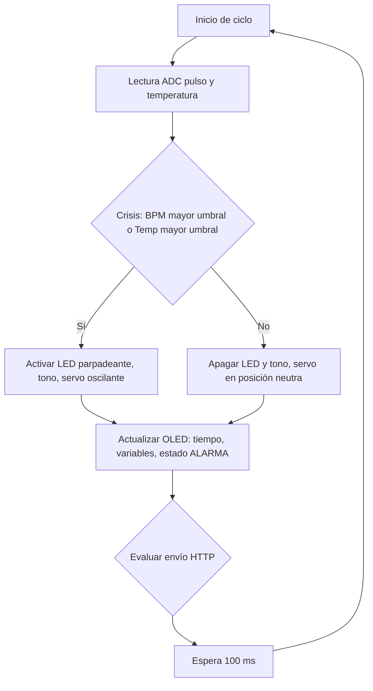
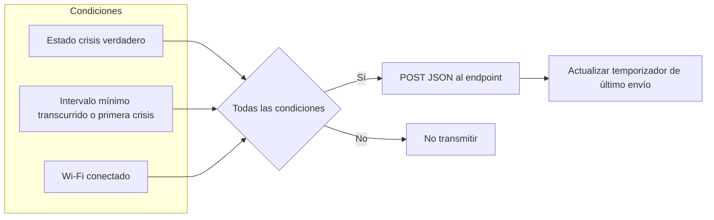
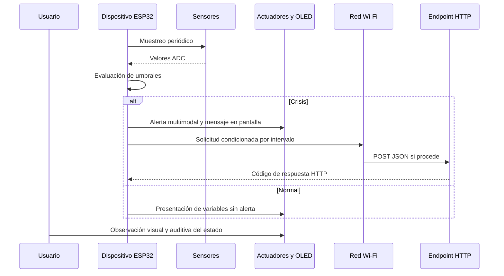

# Capítulo V: Solution UI/UX Design

## 5.1. Style Guidelines.
En esta sección, presentaremos el concepto de diseño para la página web,
la aplicación móvil y el iot, para proporcionar a nuestros usuarios una interfaz amigable
y funcional. Con este propósito en mente, hemos optado por compartir un proyecto
Figma en el que hemos trabajado todos y el cual todos pueden editar y usar los
Assets, fonts y demás.
### 5.1.1. General Style Guidelines.
- **Branding:** El branding del logo de nuestra aplicación "PSYMED" representa un cerebro
  sobre un fondo verde, simbolizando la fusión entre la salud mental
  y el soporte administrativo eficiente. El cerebro es un emblema
  universal del conocimiento y la mente humana, lo que lo convierte
  en la elección ideal para una plataforma dedicada a apoyar a los
  médicos en el campo de la salud mental. El fondo verde añade una sensación de equilibrio, serenidad
  y crecimiento, reflejando el entorno calmado y profesional
  que nuestra aplicación busca ofrecer. Este diseño visual
  transmite confianza y un enfoque moderno, asegurando que
  tanto los médicos como sus pacientes se sientan apoyados en
  cada etapa de su interacción con la plataforma.

  

- **Colors:**
Nuestra paleta de colores se ha seleccionado para proporcionar un 
entorno digital de apoyo a la salud mental y el bienestar, tanto para 
los psiquiatras como para sus pacientes. El objetivo principal de 
nuestra plataforma es crear un espacio donde la confianza, la claridad 
y la seguridad sean primordiales, asegurando que la interacción entre 
profesionales y pacientes sea fluida y efectiva. Este enfoque se refleja
en la selección de colores, que buscan transmitir calma, confiabilidad y 
profesionalismo. A continuación, se presenta una breve descripción de los 
colores que se utilizarán en nuestra aplicación:

- **#091133 (Azul Profundo)** Este color aporta un nivel de
  profundidad y seriedad a la plataforma, lo que lo convierte en una
  excelente elección para textos clave y elementos que requieren un
  alto contraste. Su tonalidad oscura asegura una legibilidad superior
  y destaca información crucial, permitiendo a los usuarios concentrarse
  en los detalles más importantes con facilidad. Es ideal para títulos,
  subtítulos, y enlaces que guían la experiencia del usuario de manera
  efectiva y profesional.

  

- **#FFFFFF (Blanco):** Este color ofrece una apariencia limpia y
  minimalista, siendo ideal para fondos y áreas de contenido que
  requieren claridad y simplicidad. Su neutralidad ayuda a crear
  un espacio visualmente relajante y despejado, permitiendo que
  otros colores y elementos destacados resalten de manera efectiva.
  El blanco es fundamental para proporcionar contraste y asegurar
  que el contenido sea fácil de leer y navegar, especialmente en
  secciones de la plataforma que buscan ofrecer una experiencia
  de usuario sin distracciones.

  

- **#10BEAE (Teal Brillante):** Este color vibrante y refrescante
  aporta energía y modernidad a la plataforma. Es ideal para
  elementos que requieren un toque de frescura, como botones
  de acción o enlaces destacados. Su tonalidad brillante y alegre
  asegura que los usuarios se sientan motivados y comprometidos,
  creando un ambiente visual que equilibra tanto la funcionalidad
  como la estética. Este color es perfecto para destacar
  información que debe ser notada rápidamente, sin comprometer
  la armonía general de la interfaz.

  

**Scale:**
- **Base:** El tamaño base es de 18px.
- **Ratio:** Utilizaremos un ratio de escala (por ejemplo, 1.2) que definirá la relación entre los tamaños de texto, creando una jerarquía visual consistente y armoniosa en la aplicación.

**Line Spacing (Espaciado entre líneas):** Entre 1.4 y 1.6, dependiendo del tamaño de la fuente y el contexto de uso. Esto asegurará una legibilidad óptima, especialmente en textos más largos.

### Nomenclature

- **Name / Size / Weights**

    - **Heading 0 / 22px / Medium**  
      Uso: Secciones importantes o subtítulos destacados.

    - **Heading 1 / 38px / Medium**  
      Uso: Títulos principales, como el nombre de la sección o la página.

    - **Heading 2 / 34px / Medium**  
      Uso: Subtítulos de menor jerarquía, pero aún relevantes.

    - **Heading 3 / 25px / Medium**  
      Uso: Títulos de secciones menores o encabezados de subsecciones.

    - **Heading 4 / 22px / Medium**  
      Uso: Encabezados para elementos menores, como cuadros de información o tarjetas.

    - **Base / 18px / Light**  
      Uso: Texto principal o cuerpo de texto, ideal para párrafos largos y contenido estándar.

    - **Body 1 / 10px / Regular**  
      Uso: Detalles secundarios, etiquetas pequeñas o textos de ayuda.
- **Tipo de lenguaje**
  Utilizamos un lenguaje formal para garantizar que los usuarios comprendan
  claramente la información proporcionada. Este enfoque también refleja nuestro
  compromiso con la seriedad y profesionalismo en el tratamiento de la salud
  mental.

### 5.1.2. Web, Mobile and IoT Style Guidelines.

#### Web Style Guidelines.
-**Colors:**
Los colores de la aplicación web se eligieron para crear un
entorno que promueva tranquilidad y confianza en la gestión
de la salud mental. **#308C83 (Teal Profundo)** ofrece
estabilidad, **#69BFB7 (Teal Suave)** aporta frescura y
destaca información clave, y **#C2F2ED (Aqua Ligero)**
proporciona un fondo relajante. Estos colores, en conjunto,
aseguran una experiencia visual armoniosa y profesional en la
plataforma.

**#308C83 (Teal Profundo):** Este color actúa como el tono
principal de la plataforma, evocando tranquilidad y estabilidad,
cualidades esenciales en el ámbito de la salud mental. Es ideal
para encabezados, botones de acción y elementos que requieren
destacar, asegurando que el profesional pueda navegar y tomar
decisiones de manera confiable.

  

**#69BFB7 (Teal Suave):** Utilizado para elementos secundarios y
destacados sutiles, este tono complementa el color primario,
aportando una sensación de frescura y modernidad, sin desviar
la atención de la información crítica. Es ideal para secciones
como el registro de síntomas y la visualización de citas.

  

**#C2F2ED (Aqua Ligero):** Este color se utilizará principalmente
en los fondos y áreas extensas, proporcionando un entorno
relajante y libre de distracciones. Su suavidad ayuda a reducir
la carga visual, permitiendo que tanto los profesionales como
los pacientes se concentren en el contenido relevante, como los
signos vitales y comentarios diarios.

  

### Mobile Style Guidelines.

- Colors:
  Los mismos colores base de la identidad de PSYMED se adaptan a la Material Design Guidelines de Google, aplicando jerarquías cromáticas en botones, fondos y textos.

    - #308C83 (Teal Profundo): Color primario para la app bar y acciones principales.

  

- #69BFB7 (Teal Suave): Tono complementario para estados activos, iconografía y destacados.

  

- #C2F2ED (Aqua Ligero): Color de fondo para mantener claridad y calma visual.

  

- Typography:
  Se emplea la fuente nativa Roboto, estándar en Android, asegurando legibilidad y consistencia con las guías de Material Design.

- Navigation & Components:
  La navegación principal se implementa mediante un Navigation Drawer o Bottom Navigation Bar, según la complejidad de la sección. Los componentes UI siguen patrones de Material Design (botones flotantes, tarjetas, chips), con un uso claro de sombras y elevaciones.

- Gestures:
  El diseño incorpora gestos comunes en Android, como long press para abrir menús contextuales o drag & drop en elementos interactivos.

### IoT Style Guidelines.

## 5.2. Information Architecture.
La sección de arquitectura de la información se centra en
estructurar el contenido tanto de la aplicación web como
de la página principal de **PSYMED**. Esta sección
abarca los siguientes aspectos clave:   
### 5.2.1. Organization Systems.
Para asegurar una jerarquía clara y precisa en nuestra aplicación, es crucial facilitar una navegación satisfactoria para el usuario. La estructura que hemos definido es la siguiente:

**Profesionales de la salud mental:**

Al acceder a la plataforma del proyecto para profesionales de la salud mental, los usuarios (psiquiatras, psicólogos y otros profesionales de la salud mental) pueden iniciar sesión, registrarse si no tienen una cuenta previa, escoger su plan de pago y recuperar su contraseña en caso de olvido. Una vez autenticados, la página principal presenta un calendario con las fechas de sus citas y una barra lateral con las opciones: Citas, Inicio, Pacientes y Notificaciones.

En la sección de Citas, se pueden observar todas las citas del profesional con sus pacientes, así como agendar nuevas consultas o modificar horarios.

En la sección Pacientes, los profesionales pueden ver una lista de sus pacientes actuales y seleccionar a uno para acceder a su perfil detallado, con una barra lateral que incluye las opciones: Diagnóstico, Historial Clínico, Terapia, Citas.

- En Diagnóstico, se puede visualizar y agregar un nuevo diagnóstico, así como revisar el historial de diagnósticos previos.
- En Historial Clínico, se muestra la información clínica del paciente.
- En la sección Terapia, se centralizan botones para acceder a: Funciones Biológicas, Estados de Ánimo, Prescripción y Track de Pastillas.
    - Funciones Biológicas: muestra reportes estadísticos de los datos fisiológicos del paciente.
    - Estados de Ánimo: permite observar el registro y evolución emocional del paciente.
    - Prescripciones: contiene la lista de medicamentos con sus datos, dosis, frecuencia y duración del tratamiento. Incluye la opción de agregar o modificar medicamentos.
    - Track de Pastillas: permite confirmar el consumo de los medicamentos.

En la sección de Notificaciones, los profesionales reciben confirmaciones sobre actividades realizadas por los pacientes.

---
**Pacientes:**

Al acceder a la plataforma, los usuarios pueden iniciar sesión con sus credenciales, cambiar la contraseña en caso necesario, y una vez autenticados, la página principal presenta un Sidebar con las opciones: Inicio, Terapia, Citas.

En la sección "Lista de Tareas" se pueden visualizar los
conjuntos de actividades designados por el profesional de
la salud mental en cada sesión. Dentro de esta vista, se puede
acceder a opciones tales como ver tareas y marcar como completadas.

- En la sección Terapia, se muestran accesos a Diagnóstico, Funciones Biológicas, Estados de Ánimo y Prescripción.
    - Diagnóstico: visualización del diagnóstico otorgado por el profesional.
    - Funciones Biológicas: muestra los registros de datos fisiológicos.
    - Estados de Ánimo: muestra el seguimiento de los estados emocionales.
    - Prescripción: permite visualizar los medicamentos recetados y confirmar su consumo.
- En la sección Citas, los pacientes pueden visualizar las citas programadas y acceder a sus detalles.
- En la sección Perfil, se puede visualizar y actualizar la información personal, incluyendo datos de contacto y de salud.

  

### 5.2.2. Labeling Systems.

**Profesionales de la salud mental:**

**inicio**
- Iniciar sesión
- Registrarse
- Recuperar su contraseña

1. **Navegación Principal** (Header/Barra de navegación lateral)
   **Página** principal del usuario después de iniciar sesión.
   **Citas:** Calendario y gestión de citas con pacientes.
   **Pacientes:** Gestión de pacientes y acceso a historiales clínicos.
   **Notificaciones:** Alertas y confirmaciones de actividades.
   **Perfil:** Información del profesional de salud mental.
   Ajustes: Configuración y seguridad de la cuenta.

**Pacientes**
- lista de sus pacientes
    - Historial de citas
    - Tratamientos en curso
        - Diagnósticos
        - Datos fisiológicos
        - Registro de estados de ánimo
        - Tareas asignadas
        - Asignar Medicamentos

**Agenda:**
- Agendar nuevas consultas
- Modificar horarios
- Enviar recordatorios

**Perfil:**
- Datos de contacto
- Especialidad

**Ajustes:**
- Cambiar contraseñas

---
**Pacientes:**

**Inicio**
- Iniciar sesión
- Cambiar la contraseña

**Pagina principal**
- Perfil
- Citas
- Tratamiento Actual

**Perfil:**
- Datos de contacto
- Datos de salud

**Citas:**
- Ver detalles de la cita

**Tratamiento Actual:**
- Registro de Medicamentos
- Diagnóstico Actual
- Formulario de Estados de Ánimo
    - Registro de Estados Fisiológicos
    - Ver datos estadísticos de su estado a lo largo del tratamiento

### 5.2.3. SEO Tags and Meta Tags

Las etiquetas reflejan el contenido de nuestro proyecto, abarcando tanto la Landing Page como el Sitio Web. Han sido creadas para mejorar la visibilidad de nuestro proyecto en los principales motores de búsqueda, lo que permitirá a los usuarios encontrar fácilmente nuestra aplicacion de PSYMED.

Para la landing page:
- **Título:** PSYMED - Plataforma de Gestión de Salud Mental
- **Descripción:** PSYMED - plataforma de gestión de salud mental - LandingPage .
- **keywords:** Salud Mental, Psiquiatras, Software, Citas Médicas, Historial Clínico, Plataforma Psicólogos, Registro Pacientes, Tratamiento Psicológico, Seguimiento Pacientes.
- **Author:** closedSource
  para el Web Side:
- **Título:** PSYMED - Plataforma de Gestión de Salud Mental
- **Descripción:** PSYMED - plataforma de gestión de salud mental - Web Side .
- **keywords:** Salud Mental, Psiquiatras, Software, Citas Médicas, Historial Clínico, Plataforma Psicólogos, Registro Pacientes, Tratamiento Psicológico, Seguimiento Pacientes.
- **Author:** Go8u

### 5.2.4. Searching Systems.

Los médicos pueden utilizar los métodos de búsqueda por:

- Filtrado de Información por Fechas:
    - Búsqueda de sesiones por fecha
    - Búsqueda de diagnósticos por fecha
    - Búsqueda de prescripciones por fecha
    - Ver sesiones por fecha

Los pacientes pueden utilizar los metodos de busqueda por:
- Filtrado de información por ID
    - Confirmación de prescripciones por ID

### 5.2.5. Navigation Systems.

**Para Profesionales de la salud mental:**

En la plataforma para profesionales de salud mental, tras iniciar sesión, los usuarios acceden a un panel de control con un menú superior que incluye "Inicio", "Pacientes", "Agenda", "Perfil" y "Ajustes".

En "Pacientes", pueden ver y gestionar perfiles detallados de los pacientes, incluyendo historial de citas y tratamientos.

"Agenda" muestra un calendario con citas programadas y permite agendar nuevas, modificar horarios y enviar recordatorios.

En "Perfil", se visualiza la información personal del profesional y en "Ajustes", se gestionan aspectos de seguridad de la cuenta.

**Para Pacientes:**

Al ingresar, los pacientes ven un panel con opciones como "Inicio", "Perfil", "Citas" y "Tratamiento Actual".

"Tratamiento Actual" ofrece detalles sobre prescripciones, diagnósticos, estados de ánimo y datos estadísticos.

"Citas" permite ver y gestionar citas programadas, mientras que "Perfil" muestra la información personal del paciente.

Este sistema asegura un acceso rápido y sencillo a las funciones y datos clave tanto para psiquiatras como para pacientes.

## 5.3. Landing Page UI Design.
### 5.3.1. Landing Page Wireframe.

  

### 5.3.2. Landing Page Mock-up.

  

## 5.4. Applications UX/UI Design.
### 5.4.1. Applications Wireframes.

#### Mobile Wireframes.

#### Web Wireframes.

En esta sección se presentan los Wireframes de la Aplicación Web, con cada pantalla teniendo un nombre y un propósito definido.

Home: Pantalla principal de la aplicación, que proporciona acceso a las diferentes funciones y secciones, como el registro, inicio de sesión y navegación general de la aplicación.

Register: Sección donde los nuevos usuarios pueden crear una cuenta proporcionando su información personal y credenciales para acceder a la aplicación.

Login: Pantalla donde los usuarios existentes pueden ingresar sus credenciales para acceder a su cuenta y las funciones principales de la plataforma.

Cambio de Contraseña: Permite a los usuarios restablecer su contraseña en caso de haberla olvidado o de desear cambiarla por motivos de seguridad.

Profesionales Home: Pantalla de inicio para los profesionales de la salud, que proporciona acceso a todas las herramientas y funciones disponibles para el manejo de pacientes.

Perfil Profesional: Sección donde los profesionales pueden ver su información personal y profesional.

Agregar Paciente: Función que permite a los profesionales registrar nuevos pacientes, ingresando datos personales y clínicos para su seguimiento.

Lista de Pacientes: Pantalla que muestra a los profesionales una lista de todos los pacientes registrados bajo su cuidado, con opciones para ver detalles o realizar acciones.

Configuración del Paciente: Sección donde los profesionales pueden editar la información y preferencias de cada paciente, incluyendo ajustes clínicos y personales.

Creación de Cita: Permite a los profesionales agendar nuevas citas para los pacientes, definiendo la fecha, hora y detalles específicos de la consulta.

Edición de Cita: Función que permite modificar los detalles de una cita previamente agendada, como cambiar la fecha, hora o propósito.

Registro de Documentación Médica: Sección donde los profesionales pueden cargar y registrar documentos médicos relevantes para cada paciente, como resultados de exámenes o diagnósticos.

Agenda Profesional: Calendario donde los profesionales pueden ver todas sus citas programadas y tareas pendientes, organizadas de manera diaria o semanal.

Datos del Paciente: Pantalla que permite a los profesionales acceder a toda la información relevante de un paciente, incluyendo historial médico y documentación.

Lista de Estados de Ánimo: Sección donde se puede registrar y monitorear los estados de ánimo de los pacientes para dar seguimiento a su evolución emocional.

Test Interdiario: Función que permite a los pacientes completar un test diario sobre su estado emocional y físico para un monitoreo continuo.

Registro Diario del Paciente: Permite a los pacientes realizar un seguimiento diario de su estado de salud, registrando síntomas, emociones o cambios relevantes.

Agenda del Paciente: Calendario donde los pacientes pueden ver sus citas programadas con los profesionales, con la posibilidad de recibir recordatorios y actualizar citas.

### 5.4.2. Applications Wireflow Diagrams.

#### Mobile Wireflow Diagrams.

#### Web Wireflow Diagrams.

### 5.4.2. Applications Mock-ups.

#### Mobile Mock-ups.

#### Web Mock-ups.

En este apartado se muestran los Mock-Ups de la Aplicación Web, con notable más detalle que los Wireframes. Cada pantalla tiene un nombre y propósito específico.

Home: Pantalla principal de la aplicación, que proporciona acceso a las diferentes funciones y secciones, como el registro, inicio de sesión y navegación general de la aplicación.

Register: Sección donde los nuevos usuarios pueden crear una cuenta proporcionando su información personal y credenciales para acceder a la aplicación.

Login: Pantalla donde los usuarios existentes pueden ingresar sus credenciales para acceder a su cuenta y las funciones principales de la plataforma.

Cambio de Contraseña: Permite a los usuarios restablecer su contraseña en caso de haberla olvidado o de desear cambiarla por motivos de seguridad.

Profesionales Home: Pantalla de inicio para los profesionales de la salud, que proporciona acceso a todas las herramientas y funciones disponibles para el manejo de pacientes.

Perfil Profesional: Sección donde los profesionales pueden ver y editar su información personal y profesional, como nombre, especialidad y datos de contacto.

Agregar Paciente: Función que permite a los profesionales registrar nuevos pacientes, ingresando datos personales y clínicos para su seguimiento.

Lista de Pacientes: Pantalla que muestra a los profesionales una lista de todos los pacientes registrados bajo su cuidado, con opciones para ver detalles o realizar acciones.

Configuración del Paciente: Sección donde los profesionales pueden editar la información y preferencias de cada paciente, incluyendo ajustes clínicos y personales.

Creación de Cita: Permite a los profesionales agendar nuevas citas para los pacientes, definiendo la fecha, hora y detalles específicos de la consulta.

Edición de Cita: Función que permite modificar los detalles de una cita previamente agendada, como cambiar la fecha, hora o propósito.

Registro de Documentación Médica: Sección donde los profesionales pueden cargar y registrar documentos médicos relevantes para cada paciente, como resultados de exámenes o diagnósticos.

Agenda Profesional: Calendario donde los profesionales pueden ver todas sus citas programadas y tareas pendientes, organizadas de manera diaria o semanal.

Lista de Estados de Ánimo: Sección donde se puede registrar y monitorear los estados de ánimo de los pacientes para dar seguimiento a su evolución emocional.

Test Interdiario: Función que permite a los pacientes completar un test diario sobre su estado emocional y físico para un monitoreo continuo.

Registro Diario del Paciente: Permite a los pacientes realizar un seguimiento diario de su estado de salud, registrando síntomas, emociones o cambios relevantes.

Agenda del Paciente: Calendario donde los pacientes pueden ver sus citas programadas con los profesionales, con la posibilidad de recibir recordatorios y actualizar citas.

### 5.4.3. Applications User Flow Diagrams.

#### Mobile User Flow Diagrams.

#### Web User Flow Diagrams.

En este flow se puede ver el proceso por el que el médico agenda citas.

En este flow se puede ver el proceso por el que se ve las citas de un paciente.

En este flow se puede ver el proceso por el que se ve el registro de citas de un paciente.

En este flow se puede ver como el profesional añade diagnosticos a los pacientes.

En este flow se puede ver como el profesional edita los diganosticos de los pacientes.

En este flow se puede ver como el profesional edita el historial clinico de los pacientes.

En este flow se puede ver como el profesional añade un historial clinico al paciente.

En este flow se puede ver como el profesional edita los datos de los pacientes

En este flow se puede ver como el profesional observa las funciones biologicas

En este flow se puede ver como el profesional añade una lista de medicamentos.

En este flow se puede observar como administra los medicamentos de los pacientes.

En este flow se puede observar como el profesional agrega un nuevo paciente.

En este flow se puede observar como el profesional observa la pantalla de perfil.

En este flow se puede observar como el profesional se loguea e ingresa a la pagina principal.

En este flow se puede observar como el profesional se registra en la plataforma.

## 5.5. Applications Prototyping.

#### Mobile Prototyping.

En esta sección se presenta el prototipo de la aplicación móvil. El prototipo refleja las pantallas principales, la navegación y la interacción previstas para los usuarios del sistema en dispositivos Apple.

El prototipo puede visualizarse en el siguiente enlace: [https://marvelapp.com/prototype/34ij6a2g](https://marvelapp.com/prototype/34ij6a2g)

#### Web Prototyping.

Para validar la usabilidad, la experiencia de usuario y los flujos de interacción definidos en la aplicación, se desarrolló un prototipo navegable que permite visualizar las principales pantallas y funcionalidades. Este prototipo facilita la retroalimentación temprana y asegura la alineación del diseño con los requerimientos del sistema.

El prototipo completo puede visualizarse en el siguiente enlace:

[https://marvelapp.com/prototype/8j2efjg](https://marvelapp.com/prototype/8j2efjg)

## 5.6. IoT Device Design.

## 1. Introducción y criterios de decisión de diseño

### 1.1 Objetivo del dispositivo

El dispositivo tiene como función principal la **adquisición periódica de señales proxy** asociadas a frecuencia cardíaca y temperatura, la **presentación local** de dichos valores y del estado clínico simplificado (normal versus alarma), la **activación coordinada de actuadores** cuando se detecta una crisis según umbrales definidos en firmware, y el **registro selectivo** de eventos hacia un endpoint HTTP en formato JSON, condicionado a la presencia de alarma y a un intervalo mínimo entre transmisiones con el fin de limitar carga de red y redundancia de datos.

### 1.2 Criterios de diseño

Los criterios que orientan las decisiones técnicas son los siguientes:

| Criterio | Implicación en el diseño |
|----------|---------------------------|
| **Trazabilidad temporal** | Sincronización mediante NTP y sellado de tiempo en cargas útiles y en pantalla, alineado con la necesidad de correlacionar eventos clínicos con registros remotos. |
| **Multimodalidad de la alarma** | Combinación de canal visual (LED), auditivo (zumbador) y cinestésico o motor (servomotor), de modo que la alerta no dependa de un único canal sensorial del usuario. |
| **Legibilidad local** | Pantalla OLED de bajo consumo para retroalimentación continua sin depender exclusivamente del canal serial de depuración. |
| **Eficiencia de comunicación** | Envío al servidor únicamente cuando existe estado de crisis y ha transcurrido un intervalo configurable (por defecto una hora), evitando muestreo continuo innecesario del endpoint. |
| **Coherencia hardware–software** | Asignación de pines de la ESP32 acorde a restricciones del fabricante (por ejemplo, entradas analógicas en ADC1 para compatibilidad con Wi-Fi activo) y con el esquema documentado en Wokwi. |
| **Prototipado reproducible** | Uso de componentes estándar en Wokwi más un chip personalizado para la señal de pulso, permitiendo repetición del experimento en entorno simulado sin variación manual del cableado. |

### 1.3 Relación con la arquitectura de información

Las decisiones de interfaz física y de telemetría se articulan con una **arquitectura de información** en la que se distinguen, a nivel lógico, los siguientes bloques de datos transmitidos al endpoint:

- Identificador de reporte y marca temporal (`report_id`, `timestamp`).
- Datos del paciente o variables clínicas proxy (`patient_data`: frecuencia cardíaca estimada, temperatura en grados Celsius, indicador booleano de crisis).
- Registro del estado de los actuadores y del dispositivo (`device_logs`: servo, zumbador, LED de alarma, tiempo de funcionamiento).

Esta separación refleja el principio de **desacoplar el dato clínico o de interés primario** del **metadato operativo del dispositivo**, facilitando el procesamiento posterior en sistemas centrales (filtrado, auditoría, visualización) sin mezclar semánticamente magnitudes fisiológicas con el estado de hardware. La pantalla OLED replica, a escala local, un subconjunto de esa jerarquía (tiempo, variables principales, estado textual), lo que mantiene **consistencia semántica** entre lo que percibe el usuario en el dispositivo y lo que puede persistirse en el backend.

### 1.4 Alineación con una guía de estilos para interfaces físicas IoT

En ausencia de un documento de guía adjunto en este repositorio, el prototipo se diseña de forma **coherente con prácticas habituales** de interfaces físicas para dispositivos de alerta en entornos de salud o bienestar:

- **Codificación por color**: LED de alarma en color rojo, convención asociada a condición de riesgo o atención requerida.
- **Jerarquía visual en pantalla**: tamaño de fuente mayor para la variable prioritaria (frecuencia cardíaca estimada) respecto a la temperatura y al estado de alarma.
- **Redundancia controlada**: la alarma se comunica por LED, sonido y movimiento; la OLED refuerza el estado sin sustituir por completo los canales de alerta periférica.
- **Feedback de conectividad implícito**: mensaje inicial de conexión Wi-Fi en pantalla durante el arranque, reduciendo la incertidumbre del usuario respecto al estado de enlace.

Cuando el proyecto disponga de una **guía de estilos para IoT Device Physical Interfaces** aprobada por el curso o la organización, los colores, textos en pantalla y patrones de parpadeo o tono deberán contrastarse con dicha guía y documentarse las desviaciones justificadas.

---

## 2. Inventario de sensores y actuadores, con justificación

### 2.1 Sensores

#### 2.1.1 Señal de frecuencia cardíaca (chip personalizado `heart`)

**Descripción técnica.** Se emplea un **chip simulado** en Wokwi (`heart.chip.json`, `heart.chip.c`) que entrega una señal analógica en el pin `SIG`, conectada a la entrada **GPIO34** de la ESP32. El firmware interpreta la lectura ADC como magnitud proporcional y la mapea a un rango de latidos por minuto con fines demostrativos.

**Justificación.** La monitorización de la frecuencia cardíaca constituye un indicador ampliamente utilizado en sistemas de apoyo al monitoreo de estrés o crisis agudas. El uso de un **chip custom** permite modelar una señal periódica controlada en simulación, acercándose al requisito de un sensor dedicado sin depender en esta fase de un módulo comercial específico (por ejemplo, PPG dedicado). En despliegue físico, este bloque debería sustituirse por un sensor biomédico validado y su pipeline de señal correspondiente.

#### 2.1.2 Sensor de temperatura (termistor NTC)

**Descripción técnica.** Módulo **wokwi-ntc-temperature-sensor**, alimentado a 3,3 V, salida analógica hacia **GPIO32**. El firmware estima la temperatura mediante modelo de divisor de voltaje y ecuación de Steinhart–Hart simplificada (parámetro Beta).

**Justificación.** La temperatura corporal o periférica es un indicador complementario en escenarios de malestar o fiebre. El NTC ofrece lectura analógica directa con componentes mínimos y es adecuado para prototipos de laboratorio y simulación. Alternativas digitales (por ejemplo, DHT22) podrían incorporarse si el diseño de información requiriese humedad ambiente u homogeneización con otros nodos del ecosistema.

### 2.2 Actuadores y salida gráfica local

#### 2.2.1 LED de alarma (rojo, etiqueta ALARM)

**Conexión.** Ánodo a **GPIO5**, cátodo a tierra común (en montaje físico se recomienda resistencia limitadora de corriente en serie).

**Justificación.** Canal visual de bajo coste y latencia mínima. El parpadeo en firmware refuerza la detección periférica de la alarma sin exigir lectura de la pantalla.

#### 2.2.2 Zumbador (buzzer pasivo)

**Conexión.** Terminal de señal **GPIO14**, segundo terminal a GND, conforme al modelo `wokwi-buzzer`.

**Justificación.** Canal auditivo universalmente reconocible. El tono fijo configurado en firmware (880 Hz) actúa como señal de alerta distinguible del silencio en estado normal.

#### 2.2.3 Servomotor

**Conexión.** Señal PWM **GPIO13**, alimentación a **VIN** y referencia a **GND** compartida con la placa.

**Justificación.** El servomotor proporciona **retroalimentación mecánica** (oscilación controlada en estado de crisis y posición neutra en reposo). Desde la perspectiva de diseño de interacción, cumple una doble función: alerta cinestésica perceptible al tacto o por movimiento del conjunto, y patrón de “calma” o distracción motora suave, acorde con objetivos de bienestar en un prototipo Psymed.

#### 2.2.4 Pantalla OLED (SSD1306, I2C)

**Conexión.** **SDA** en GPIO21, **SCL** en GPIO22, alimentación 3,3 V y GND.

**Justificación.** No es un actuador en el sentido estricto de conversión energética hacia el entorno, pero constituye el **principal canal informativo local** continuo: hora, variables sensadas, estado de alarma. Su inclusión reduce la carga cognitiva al centralizar la lectura frente a interpretar únicamente códigos de parpadeo o sonidos.

---

## 3. Diseño de circuito e interconexión

### 3.1 Herramienta de esquema

El esquema de cableado de referencia se mantiene en **`diagram.json`** (formato nativo de Wokwi). Para entregables académicos que exijan figura en informe PDF, se recomienda **exportar captura** del lienzo de Wokwi una vez verificadas las conexiones, de modo que el diagrama impreso coincida exactamente con el utilizado en simulación.

### 3.2 Tabla resumen de conexiones

| Señal lógica (firmware) | Pin ESP32 | Destino |
|-------------------------|-----------|---------|
| Lectura pulso (ADC) | 34 | `heart1:SIG` |
| Lectura temperatura (ADC) | 32 | `ntc1:OUT` |
| PWM servo | 13 | `servo1:PWM` |
| LED alarma | 5 | `led1:A` (cátodo a GND) |
| Buzzer | 14 | `bz1:1` (`bz1:2` a GND) |
| I2C datos OLED | 21 | `oled1:SDA` |
| I2C reloj OLED | 22 | `oled1:SCL` |
| Alimentación NTC / OLED | 3V3 | `ntc1:VCC`, `oled1:VCC` |
| Alimentación servo | VIN | `servo1:VCC` |
| Referencia común | GND | Todos los GND de periféricos |

### 3.3 Consideraciones eléctricas

- **Dominios de alimentación:** periféricos de baja corriente (NTC, OLED, lógica de señal) desde 3,3 V; servo desde VIN cuando la placa recibe alimentación USB adecuada, coherente con el modelo DevKit.
- **Entrada analógica en GPIO34:** pin de **solo entrada**, apropiado para lectura del chip de pulso sin conflicto con salidas digitales.
- **Compatibilidad ADC y Wi-Fi:** GPIO32 pertenece a **ADC1**, evitando interferencias conocidas de ADC2 con el subsistema de radio Wi-Fi en el ESP32.

---

## 4. Diagramas de flujo de interacción y de datos

Los siguientes diagramas complementan el esquema eléctrico: describen el **comportamiento temporal** del firmware y los **flujos de información** entre usuario, dispositivo y red. Pueden renderizarse en cualquier visor compatible con **Mermaid** (por ejemplo, GitHub, GitLab, extensiones de editor).

### 4.1 Ciclo principal de adquisición, alarma y presentación

### 4.2 Lógica de envío al endpoint (telemetría condicionada)

Información del endpoint:

### 4.3 Flujo de interacción usuario–dispositivo–sistema remoto

---

## 5. Umbrales y parámetros configurables (referencia)

Los siguientes valores están definidos en el firmware de referencia y constituyen el contrato de comportamiento del prototipo hasta nueva calibración:

- **Crisis:** frecuencia cardíaca estimada superior a 115 min⁻¹ **o** temperatura estimada superior a 38,0 °C.
- **Intervalo mínimo entre envíos HTTP en crisis:** 3 600 000 ms (una hora), además del envío en la primera detección de crisis con temporizador no inicializado.
- **Zona horaria NTP:** UTC−5 (configuración de referencia para Perú, Colombia o Ecuador, según comentario en código).

---

## 6. Limitaciones del prototipo y trabajo futuro

- La magnitud de frecuencia cardíaca es un **proxy** derivado de ADC, no un PPG clínicamente calibrado.
- La transmisión HTTPS puede requerir configuración adicional de certificados en despliegue físico respecto al simulador.
- El campo `dependencies` del `diagram.json` para el chip `heart` debe verificarse en Wokwi para garantizar la carga del chip custom en todos los entornos.
- Sustitución del chip simulado por hardware biomédico certificado y validación con usuarios finales, según la guía de estilos y normativa aplicable.

---

## 7. Referencias de archivos del repositorio

| Archivo | Rol |
|---------|-----|
| `diagram.json` | Esquema de circuito y lista de partes Wokwi |
| `sketch.ino` | Firmware principal |
| `heart.chip.json`, `heart.chip.c` | Definición y comportamiento del chip de pulso simulado |
| `libraries.txt` | Listado de librerías de Arduino requeridas en Wokwi |

---

*Documento generado para el diseño del dispositivo IoT Psymed. Mantener sincronizado con cambios en `diagram.json` y `sketch.ino`.*
